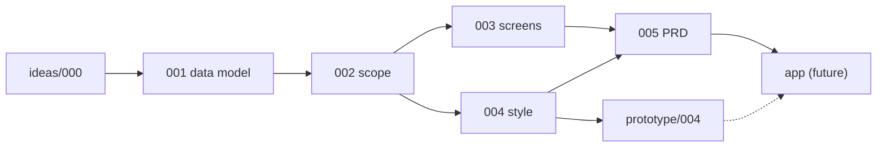

# Documentation

Written specifications for the Cashflow app. These docs define **what to build**; interactive UI reference lives in [`../prototype/`](../prototype/).

---

## Read order

| # | Document | Status | Summary |
|---|---|---|---|
| — | [`ideas/000-initial-ideas.md`](ideas/000-initial-ideas.md) | reference | Product vision, terminology, feature map |
| 1 | [`specs/001-data-model.md`](specs/001-data-model.md) | draft | Entities, fields, relationships, enums |
| 2 | [`specs/002-phase-1-scope.md`](specs/002-phase-1-scope.md) | **locked** | Phase 1 features, screens, out-of-scope |
| 3 | [`specs/003-screen-specs.md`](specs/003-screen-specs.md) | draft | Per-screen layout, actions, states |
| 4 | [`specs/004-style-guide.md`](specs/004-style-guide.md) | **locked** | Paper theme tokens, components, semantic colors |
| 5 | [`specs/005-prd.md`](specs/005-prd.md) | pending | User stories + acceptance criteria |

---

## Folder roles

### `ideas/`

Early brainstorming and historical context. Useful for understanding *why* decisions were made, but not normative once superseded by `specs/`.

### `specs/`

Decisions that implementation must follow. Numbered files encode dependency order:

```
001 data model  →  002 scope  →  003 screens  →  004 style  →  005 PRD
```

**Status meanings:**

| Status | Meaning |
|---|---|
| reference | Background material; may be outdated in places |
| draft | Written but not formally locked — review before citing as final |
| locked | Frozen for Phase 1; changes require explicit re-litigation |
| pending | Not yet written |

---

## Spec ↔ prototype mapping

| Spec | Prototype reference |
|---|---|
| [004-style-guide.md](specs/004-style-guide.md) | [`../prototype/004/`](../prototype/004/) — Paper (canonical) |
| [003-screen-specs.md](specs/003-screen-specs.md) | All three prototypes implement the same 9 screens with different themes |

Prototypes `005` (Ink) and `006` (Analytical) are exploratory alternates. Phase 1 implementation must follow **004-style-guide** and **prototype/004**.

---

## Document pipeline



---

## Contributing to docs

- New **decisions** go in `specs/` with the next available number, or as an amendment to an existing locked doc if scope allows.
- **Exploratory UI** belongs in `prototype/` — not here.
- When locking a spec, update its frontmatter `status` field and this README's status table.
