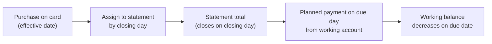
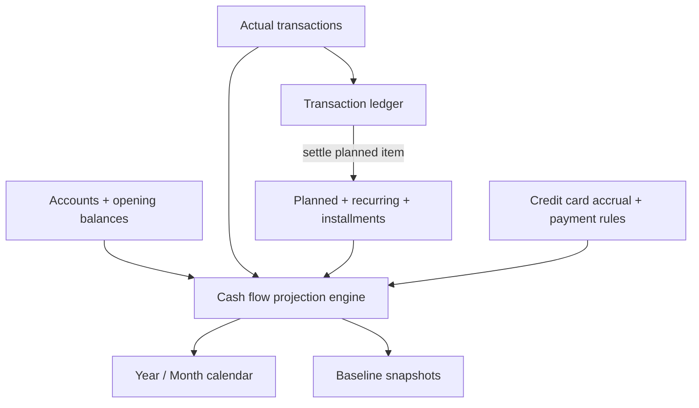

# Personal Cash Flow App — Idea Organization

## 1. Product Vision (One Sentence)

A **personal cash flow forecasting app** that answers one question every day: *“Will my spendable money (working accounts) go negative on any future date?”* — using a **linear year calendar** as the primary interface, backed by accounts, transactions, recurring obligations, and installment debt tracking.

---

## 2. Core Problem You Are Solving

Today you manage finances across **6 disconnected spreadsheet tabs** with manual sync (especially between daily ledger and monthly projections). The app should unify:

| Spreadsheet tab | What it really is | Pain today |
|---|---|---|
| **Lançamentos** | Transaction ledger (actuals) | Source of truth for what happened |
| **Contas** | Account balances (derived) | Works, but credit cards distort “available cash” |
| **Dashboard** | Summary / working cash | Underused; one useful metric: working accounts total |
| **Estudo de Gastos 2026** | Monthly expense forecast | No income; no balance projection; no ledger sync |
| **Estudo de Contas parceladas** | Installments + subscriptions + dormant debt | Mixed concerns; hard to see end dates |
| **Estudo de Investimento** | Planned investment outflows | Isolated from cash flow |

**North-star metric:** **Working Account Balance** — sum of liquid/operational bank accounts you actually spend from (excludes credit cards and typically excludes investment/broker accounts).

---

## 3. Domain Model & Correct Terminology

### 3.1 Accounts

| Term | Definition | Your examples |
|---|---|---|
| **Account** | A financial container with a balance | Cora, Santander, Banco do Brasil |
| **Account type** | Determines how it affects cash flow | `checking`, `savings`, `credit_card`, `investment`, `wallet` |
| **Working account** | Subset of accounts counted toward “money I can spend now” | Cora, Infinity Pay, Santander — not Cartão Cora |
| **Credit card account** | Liability account; balance is typically negative (debt) | Cartão Cora, Cartão C6 |
| **Investment account** | Tracked separately; outflows affect working accounts when you transfer/pay | Clear, Modal, Santander Corretora |

**Working balance** = Σ balances of accounts marked as `working`.

### 3.2 Transactions (replaces “Lançamentos”)

| Term | Definition | Spreadsheet column |
|---|---|---|
| **Income** | Money entering an account | Green “Entrada” column |
| **Expense** | Money leaving an account | Red “Saída” column |
| **Transfer** | Movement between two accounts; net worth unchanged | Yellow “Transferência” column |
| **Category** | Classification for reporting | Habitação, Alimentação, Pensão… |
| **Description / memo** | Free-text label | Column A |
| **Effective date** | When the transaction affects cash flow | Column G |
| **Account** | Which account is debited/credited | Column F |

### 3.3 Projections vs Actuals

| Term | Definition |
|---|---|
| **Actual transaction** | Something that already happened (ledger) |
| **Planned transaction** | Future income/expense you expect (forecast) |
| **Recurring rule** | Template that generates planned transactions (salary on day 5, rent on day 10, Netflix monthly) |
| **Installment plan** | Finite series of planned expenses (debt payoff schedule) |
| **Projection / forecast** | Computed daily running balance from actuals + planned items |
| **Baseline snapshot** | Frozen copy of a forecast at a point in time |
| **Variance** | Difference between baseline snapshot and actual outcome |

### 3.4 Credit Card Model (billing cycle: closing date → due date)

Credit cards are **not** part of working balance, but charges threaten future cash through a **two-date billing cycle**. Each credit card account stores two configurable days:

| Field | PT term | Meaning |
|---|---|---|
| **Closing day** | Fechamento | Day the statement closes; charges after it roll to the next statement |
| **Due day** | Vencimento | Day the closed statement must be paid from a working account |

**Statement assignment rule** — a purchase belongs to a statement based on its **effective date**:
- Charges from *the day after one closing date* through *the next closing date* belong to that statement.
- That statement is paid on the **first due day after its closing date**.
- Practical rule: if `dueDay > closingDay`, payment falls in the **same month** as closing; otherwise the **following month**.

**Example** (closing day **26**, due day **01**):

| Purchase date range | Statement closes | Payment due |
|---|---|---|
| 27/05 – 26/06 | 26/06 | 01/07 |
| 27/06 – 26/07 | 26/07 | 01/08 |

So a purchase made on 27/06 does **not** hit working cash on its purchase date — it lands on the 26/07 statement and pulls from a working account on **01/08**. The engine must compute, for any purchase, which due date it ultimately drains.

- **Card purchases** = expenses on the **credit card account** (accrue to a statement, not to working cash).
- **Statement payment** = one **planned outflow** from a **working account** on the statement's **due date**, equal to the statement total (full balance auto-computed; editable per occurrence to handle partial payment).
- **Red-dot logic** uses **aggregate working-account projection only**, but each statement's due date creates a dated working-account outflow.

### 3.5 Obligations (replaces mixed “Estudo de Contas parceladas” content)

Split into three distinct concepts:

| Term | Definition | Examples |
|---|---|---|
| **Recurring obligation** | Indefinite monthly charge | Netflix, Smart Fit, Cursor |
| **Installment plan** | Finite debt with end date | Ipanema, BB Ativos, TB Finance |
| **Dormant / deferred debt** | Known liability, not currently being paid | TIM, Mauá, negativated debts |
| **Subscription** | Recurring obligation charged to credit card | Netflix on Cartão Cora |
| **Payoff date** | Last installment date (auto-computed) | “Ipanema ends Aug 2028” |

### 3.6 Special Patterns from Your Workflow

| Pattern | Proper name | App behavior |
|---|---|---|
| Food/leisure envelope | **Allocated sub-balance / sinking fund** | Transfer from working account → dedicated “Alimentação/Lazer” account; daily small expenses deduct from that account. **Envelope accounts still count as working balance** (money set aside is still spendable), so transfers into them do not trigger red dots |
| “Paid” note on forecast cell | **Mark planned item as settled** | Converts or links forecast entry to actual ledger transaction |
| Green cell on installment | **Installment status: paid** | Paid installments stop projecting; unpaid ones continue |
| Investment down payment | **Planned capital outflow** | One-time or scheduled expense from working → investment account |

### 3.7 Account Anchoring (opening balance)

The projection engine needs a defined origin. Each account stores a **balance anchor**:

- **Anchor balance** + **anchor date** = "Cora was R$ X as of YYYY-MM-DD".
- The daily running balance is computed *forward* from the anchor using actuals + planned items.
- **Reconciliation**: the user can re-anchor any account at any time (e.g. "Cora is actually R$ Y today"); the engine recomputes from the new anchor. This replaces the spreadsheet's running-balance column with an explicit, correctable origin.

### 3.8 Recurrence Edit Scopes

Editing or deleting a **recurring rule** offers two scopes (calendar-app style):

- **This occurrence only** — creates a per-occurrence override (exception).
- **This and future** — splits the rule at the edit date; past occurrences stay unchanged.

This implies the data model needs a `RecurringRule` plus per-occurrence **overrides/exceptions**, and the ability to **split** a rule at a date when editing future occurrences.

### 3.9 Money & Currency Precision

- All monetary values stored as **integer cents (BRL)** to avoid floating-point rounding errors.
- **BRL-only in Phase 1** — foreign-currency amounts (e.g. Deel USD advance) are converted to BRL manually before entry. Multi-currency is deferred (Phase 2).

---

## 4. Feature Areas (Organized Backlog)

### A. Cash Flow Engine (backend logic — invisible but critical)

- Maintain **daily running balance** for aggregate working accounts from each account's anchor date over a **rolling 24-month** horizon.
- Inputs: account anchors (opening balances) + actual transactions + planned/recurring/installment-generated items + **credit card statement payments** (computed from each card's closing/due cycle).
- Output per day: `{ balance, inflows, outflows, belowBuffer, items[] }`, plus a global **next negative date** for proactive alerts.
- Money in integer cents; BRL-only in Phase 1 (multi-currency deferred to Phase 2).

### B. Linear Calendar — Year View (primary UI)

Inspired by the clean horizontal year grid (months as rows, weekdays as columns):

- **Year-at-a-glance** with weekend columns subtly shaded.
- Each day cell shows:
  - Day number
  - **Red dot** if projected aggregate working balance &lt; buffer (buffer configurable, default R$ 0)
  - Optional subtle indicators: income (green), large outflow (amber), card statement due
- **Click day** → side panel / modal:
  - Projected balance that day
  - List of items affecting that day (actual + planned)
  - Quick add: income / expense / transfer
  - Toggle recurrence when creating
- **Navigation**: scroll horizontally through the year; jump to today.

### C. Month View (secondary UI)

- Traditional month grid or list-by-day — same data as year view, denser detail.
- Better for: adding many items, reviewing a single month’s cash flow, comparing inflow vs outflow totals.
- Same red-dot and click-to-detail behavior.

### D. Transaction Ledger (replaces Lançamentos)

- Chronological list with filters (account, category, date range, type).
- Create/edit: income, expense, transfer (two-legged).
- Running balance column per account (like your column K).
- Link to forecast: “this actual transaction settles this planned item.”

### E. Accounts (replaces Contas)

- List all accounts with current balance, last updated, optional metadata (agency, PIX — nice-to-have).
- Toggle **“Include in working accounts”** per account.
- Show **Working balance** prominently (your Dashboard cell L19 concept).
- Credit cards show liability balance separately.

### F. Forecast & Recurring Items (replaces Estudo de Gastos + part of parceladas)

- **Planned income** (missing from your current forecast sheet — new capability).
- **Planned expenses** with due day-of-month.
- **Recurrence**: none, weekly, monthly, yearly, custom.
- Status: `projected` → `paid/settled` → optionally linked to ledger entry.
- Envelope accounts (food/leisure): show allocated vs spent.

### G. Installments & Subscriptions (replaces Estudo de Contas parceladas)

- **Installment plans**: amount, due day, start/end, remaining payments, payoff date.
- **Subscriptions**: amount, billing day, card/account, active/paused.
- **Dormant debts**: tracked but excluded from projection until activated.
- Visual: timeline or calendar markers showing when each debt **ends**.

### H. Investments (replaces Estudo de Investimento)

- Planned investment outflows (e.g. “Sinal ap 2207 — R$ 5,000”).
- Optional: track investment account balances separately from working cash.
- Phase 1 scope: treat as planned expenses/transfers, not portfolio analytics.

### I. Baseline Snapshots (new capability)

- **Create snapshot**: name + date + full forecast state (all planned items + balances).
- **Compare views**: snapshot vs current actuals — highlight over/under spend by category or by month.
- Use cases: “At start of June, I thought I’d have R$ X; today I have R$ Y.”

### J. AI Insights (Phase 2)

- Summarize cash flow risk: “3 negative-balance days in August driven by financing + pension payments.”
- Suggest actions: “Delay X payment” / “You’re averaging R$ Y over budget on food.”
- Natural language queries: “Can I afford R$ 3,000 on July 15?”
- Requires: structured projection data + optional anonymized export to LLM.

### K. Internationalization (i18n)

- **UI languages**: Portuguese (pt-BR) + English (en).
- **Locale formatting**: dates (DD/MM/YYYY vs MM/DD/YYYY), currency (BRL primary), number separators.
- Domain terms consistent in both languages (see glossary below).

---

## 5. Glossary: PT ↔ EN (for i18n keys)

| Portuguese (your terms) | English (app term) |
|---|---|
| Lançamentos | Transactions |
| Entrada | Income |
| Saída | Expense |
| Transferência | Transfer |
| Contas | Accounts |
| Contas de trabalho / working accounts | Working accounts |
| Saldo | Balance |
| Saldo projetado | Projected balance |
| Estudo de Gastos | Cash flow forecast |
| Despesa fixa | Recurring expense |
| Conta parcelada | Installment plan |
| Assinatura | Subscription |
| Dívida inativa | Dormant debt |
| Vencimento | Due date |
| Quitação / fim do pagamento | Payoff date |
| Snapshot / foto de referência | Baseline snapshot |
| Pendências | Outstanding obligations |
| Habitação, Pensão, etc. | Categories (keep translatable) |

---

## 6. Screen Map (High-Level — detail in next step)

| Screen | Primary purpose |
|---|---|
| **Year Calendar** | Main hub — projection + red-dot warnings |
| **Month Calendar** | Detailed month editing/review |
| **Day Detail Panel** | Balance breakdown + quick add (slides over calendar) |
| **Transactions** | Actual ledger (Lançamentos) |
| **Accounts** | Balances + working-account config |
| **Forecast Items** | Manage recurring, planned income/expense |
| **Installments & Subscriptions** | Debt schedules + payoff dates |
| **Investments** | Planned capital allocations |
| **Snapshots** | Create & compare baselines |
| **Settings** | Language, currency, working-account rules, card payment logic |
| **Insights** (Phase 2) | AI summaries |

**Dashboard** as a separate screen is optional for Phase 1 — the **Working balance + next negative date** can live in the calendar header.

---

## 7. Data Flow (How It All Connects)

This replaces your manual sync between **Estudo de Gastos** and **Lançamentos**.

---

## 8. Suggested Phasing (Two phases)

### Phase 1 — Complete cash flow app
- Local-first storage with export/backup; money stored as integer cents (BRL)
- Accounts with working-account flag + balance anchoring (opening balance)
- Transaction ledger (income, expense, transfer)
- Planned items with monthly recurrence (this / this+future edit scopes)
- Credit card billing cycle: closing day → due day, statement-based payment projection
- Category budgets (monthly targets)
- Daily projection engine over rolling 24 months (aggregate working balance)
- **Year linear calendar** with red dots (configurable buffer) + day detail
- **Month view** (detailed month editing/review)
- Proactive "next negative date" + lead-time alert
- Installment plans + subscriptions + payoff dates
- Baseline snapshots (full clone) + variance view (incl. budget vs actual by category)
- Envelope / sinking-fund accounts (food/leisure pattern)
- Lightweight bulk-entry + CSV import for onboarding
- pt-BR + en UI

### Phase 2 — Advanced & platform
- **What-if simulation** ("Can I afford R$ X on date Y?")
- AI insights
- Full spreadsheet import from your Google Sheets structure
- PWA offline support
- Multi-currency (FX rate per transaction)

---

## 9. Resolved Design Decisions

| Decision | Choice | Notes |
|---|---|---|
| **Horizon length** | **Rolling 24 months** from today | Catches long installment payoff dates |
| **Negative threshold** | **Configurable buffer, default R$ 0** | Red dot when projected balance &lt; buffer |
| **Card payment cycle** | **Closing day + due day per card** | Purchase date → statement → due-date outflow (see §3.4) |
| **Card payment amount** | **Full statement balance, auto-computed** | Editable per occurrence for partial payments |
| **Negative detection scope** | **Aggregate working balance** | Sum of all working accounts |
| **Envelope accounts** | **Count as working balance** | Set-aside money is still spendable |
| **Recurrence editing** | **This / This+future** | Per-occurrence overrides + rule split at edit date (see §3.8) |
| **Category budgets** | **In Phase 1** | Monthly target per category; feeds variance views |
| **Currency** | **BRL-only in Phase 1** | Cents as integers; multi-currency deferred to Phase 2 |
| **What-if simulation** | **Phase 2** | Forward-looking "can I afford X?", distinct from snapshots |
| **Alerts** | **Proactive** | Surface "next negative date" + lead-time warning |
| **Storage / architecture** | **Local-first with export/backup** | Personal use, full data ownership |
| **Snapshot granularity** | **Full forecast clone** | Enables true baseline-vs-actual variance |
| **Onboarding / import** | **Bulk-entry + lightweight CSV import in Phase 1** | Full Google Sheets import in Phase 2 |

---

## 10. What Comes Next (Per Your Request)

Ideas are organized and the key design decisions are resolved (§9). Recommended order:

1. ✅ **Data model / schema** — concrete entities, fields, and relationships. Done: `docs/specs/data-model.md`.
2. **PRD** — goals, user stories, acceptance criteria, v1 scope
3. **Style guide** — linear calendar aesthetic (minimal, weekday columns, weekend bands, red-dot semantics, typography/color tokens)
4. **Screen-by-screen spec** — fields, actions, empty states for each screen above

---

## Summary

Your app is best described as a **Cash Flow Forecasting App** centered on a **Linear Year Calendar**, not a generic budget tracker. The spreadsheet maps cleanly to: **Ledger + Accounts + Forecast + Installments + Snapshots**. The distinguishing logic is **working-account projected balance** with a proper **credit card accrual → due-date payment** model, red-dot warnings, and eventual **baseline vs actual** comparison — replacing the manual sync you do today between forecast and ledger tabs.
