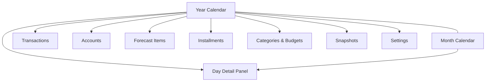

# Phase 1 Scope Lock

> **Purpose:** Prevent scope creep during design and spec work. Everything listed here ships in Phase 1. Everything in [Out of scope](#out-of-scope-phase-2) waits for Phase 2.
>
> **Sources:** [000-initial-ideas.md §8–9](../ideas/000-initial-ideas.md), [001-data-model.md](./001-data-model.md)

---

## 1. Product goal (Phase 1)

Answer one question every day:

> **Will my aggregate working-account balance go below my buffer on any future date?**

**North-star metrics (calendar header, not a separate dashboard):**
- Current **working balance** (sum of accounts marked `isWorking`)
- **Next negative date** (first day projected balance &lt; buffer)
- Proactive **in-app** alert (calendar header badge/banner) when next negative date is within lead time (`Settings.alertLeadTimeDays`); no push notifications in Phase 1

---

## 2. Features in scope

### 2.1 Data & storage

| Feature | Detail |
|---|---|
| Local-first storage | SQLite or equivalent; all data on device |
| Export / backup | Full JSON export of all entities |
| Money precision | Integer cents (BRL only) |
| Account anchoring | `anchorBalanceCents` + `anchorDate` per account; re-anchorable |

### 2.2 Accounts

| Feature | Detail |
|---|---|
| Account types | `checking`, `savings`, `wallet`, `credit_card`, `investment` |
| Working-account flag | Toggle per account; drives aggregate projection |
| Credit card config | `closingDay`, `dueDay`, `defaultPayFromAccountId`; balance = positive amount owed; opening debt seeds first due statement |

### 2.3 Transactions (ledger)

| Feature | Detail |
|---|---|
| Types | Income, expense, transfer (single-row + `toAccountId`); card payments require `paysStatementId` |
| Filters | Account, category, date range, type |
| Running balance | Per-account column (derived from anchor + transactions) |
| Settlement linking | Actual settles planned item, installment, or statement payment (canonical link on `Transaction` / `Installment`) |

### 2.4 Forecast & recurrence

| Feature | Detail |
|---|---|
| Planned items | One-off + recurring (`once`, `weekly`, `monthly`, `yearly`) |
| Recurrence edit | **This occurrence** or **This and future** only (no "all") |
| Subscriptions | Recurring charges on card or account (`isSubscription`) |
| Dormant items | `isActive = false` — visible, excluded from projection |
| Investment outflows | One-off **transfers** to investment accounts via Forecast Items (no portfolio analytics) |

### 2.5 Credit cards

| Feature | Detail |
|---|---|
| Billing cycle | Closing day → due day; purchase date assigns to statement |
| Statement payments | Auto-computed full balance; editable per statement (`plannedPaymentCents`) |
| Materialization | All statements pre-created within 24-month horizon |

### 2.6 Installments & debt

| Feature | Detail |
|---|---|
| Installment plans | Finite series with payoff date |
| Eager installment rows | All `Installment` rows created at plan save |
| Per-installment status | `scheduled` / `paid`; paid stops projecting; count cannot be reduced below highest paid index |
| Subscriptions | Indefinite recurring (via `PlannedItem`) or tagged subscription |
| Dormant debt | Tracked, `isActive = false`, excluded until activated |

### 2.7 Categories, budgets & snapshots

| Feature | Detail |
|---|---|
| Category management | Create/edit/archive expense and income categories; one-level parent/child hierarchy |
| Category budgets | Monthly target per **expense** category (`CategoryBudget`); set amount + `effectiveFromMonth` on **Categories & Budgets** screen |
| Budget tracking | Current-month actual vs target per category (and parent roll-up); progress bars and over/under on **Categories & Budgets** |
| Snapshots | Full forecast clone at a point in time |
| Variance view | Snapshot vs current actuals; over/under by category and month (also surfaced on **Categories & Budgets** when a snapshot is selected) |

### 2.8 Projection engine

| Feature | Detail |
|---|---|
| Horizon | Rolling 24 months from today |
| Detection | Aggregate working balance vs configurable buffer (default R$ 0) |
| Alert delivery | In-app only — calendar header badge/banner when `nextNegativeDate` is within `alertLeadTimeDays` |
| Output | Daily balance, inflows/outflows, items[], `belowBuffer`, `nextNegativeDate` |
| Sources | Anchors + actuals + planned + installments + statement due payments |

### 2.9 Calendar UI

| Feature | Detail |
|---|---|
| Year view | Linear horizontal grid; months as rows, weekdays as columns |
| Red dots | Days where projected balance &lt; buffer |
| Indicators | Income (green), large outflow (amber, configurable threshold `largeOutflowThresholdCents`), card statement due |
| Month view | Same data, denser layout for single-month editing |
| Day detail panel | Balance breakdown, item list, quick-add |

### 2.10 Onboarding & i18n

| Feature | Detail |
|---|---|
| CSV import | Lightweight bulk entry for accounts, transactions, planned items |
| UI languages | pt-BR + en |
| Locale formatting | Dates, currency, number separators per language |

---

## 3. Screens in scope

Phase 1 ships **10 screens/panels**. No separate Dashboard or Investments screen.

| # | Screen / panel | Phase 1 scope summary |
|---|---|---|
| 1 | **Year Calendar** | Main hub; header = working balance + next negative date + alert badge |
| 2 | **Month Calendar** | Month grid/list; same projection data, denser editing |
| 3 | **Day Detail Panel** | Slide-over from calendar; projected balance, items, quick-add |
| 4 | **Transactions** | Chronological ledger with filters and running balance |
| 5 | **Accounts** | List, balances, working flag, card cycle config, re-anchor |
| 6 | **Forecast Items** | Planned income/expense/transfer, recurrence, subscriptions, **investment outflows** |
| 7 | **Installments & Subscriptions** | Plans, payoff dates, per-installment paid status, dormant debt |
| 8 | **Categories & Budgets** | Category CRUD; set monthly budget per category; track current-month actual vs target (child + parent roll-up) |
| 9 | **Snapshots** | Create baseline, compare variance by category/month |
| 10 | **Settings** | Language, buffer, large-outflow threshold, horizon, alert lead time, export/backup, card defaults |

### Screen decisions (locked)

| Question | Decision |
|---|---|
| Separate Dashboard? | **No** — metrics in calendar header |
| Separate Investments screen? | **No** — investment outflows are one-off transfers in **Forecast Items** (see [000-initial-ideas.md §4.H](../ideas/000-initial-ideas.md)) |
| Insights screen? | **Phase 2** — stub only in screen specs |

### Navigation (high level)

Primary entry: **Year Calendar**. Other screens reachable from header/nav; Month view toggles from calendar.

---

## 4. Data model entities (Phase 1)

All entities in [001-data-model.md](./001-data-model.md) are in Phase 1 — nothing is deferred at the schema level. Phase 2 features (what-if, AI) use engine overlays, not new persisted entities.

| Entity | Phase 1 use |
|---|---|
| `Account` | Full |
| `Category` | Full (one-level hierarchy) |
| `CategoryBudget` | Full |
| `Transaction` | Full |
| `PlannedItem` | Full |
| `PlannedItemOverride` | Full |
| `CreditCardStatement` | Full |
| `InstallmentPlan` | Full |
| `Installment` | Full (eager) |
| `Snapshot` + `SnapshotPayload` | Full |
| `Settings` | Full |

---

## 5. Out of scope (Phase 2)

Explicitly **not** built in Phase 1. Screen specs get one-line deferred stubs only.

| Feature | Phase 2 notes |
|---|---|
| **What-if simulation** | "Can I afford R$ X on date Y?" — read-only engine overlay |
| **AI insights** | Summaries, suggestions, NL queries; **Insights** screen |
| **Full Google Sheets import** | Maps existing 6-tab spreadsheet structure |
| **PWA offline support** | Installable app, service worker |
| **Multi-currency** | FX rate per transaction; display in BRL + original |

---

## 6. Non-functional requirements (Phase 1)

| Requirement | Target |
|---|---|
| Platform | Web app, local-first (browser + local DB) |
| Performance | Projection recompute &lt; 500 ms for typical dataset on laptop |
| Data ownership | No cloud account required; export anytime |
| Privacy | No telemetry; no LLM calls |
| Accessibility | Keyboard navigation for calendar grid (baseline; full audit later) |

---

## 7. Resolved decisions (inherited — do not re-litigate)

Copied from [000-initial-ideas.md §9](../ideas/000-initial-ideas.md) and [001-data-model.md §8](./001-data-model.md). Screen specs and style guide must conform.

| Area | Decision |
|---|---|
| Horizon | Rolling 24 months |
| Red-dot threshold | Configurable buffer, default R$ 0 |
| Negative detection | Aggregate working balance |
| Category budgets | Monthly target per category; actual vs target on **Categories & Budgets** |
| Recurrence edit | This / This+future |
| Card balance sign | Positive = amount owed |
| Opening card debt | Seeds first due statement in projection |
| Settlement link | Canonical on `Transaction` / `Installment` |
| Installments | Eager row generation |
| Transfers | Single row + `toAccountId` |
| Statements | Pre-create full horizon per card |
| Categories | One parent level max |
| Snapshots | Full forecast clone |

---

## 8. Screen spec decisions (resolved in [003-screen-specs.md](./003-screen-specs.md))

| Item | Decision | Spec ref |
|---|---|---|
| Month view layout | Month grid (same weekday columns as year, single month) | [003 §4](./003-screen-specs.md#4-screen-2--month-calendar) |
| Snapshot compare UI | Side-by-side month table + category breakdown | [003 §11](./003-screen-specs.md#11-screen-9--snapshots) |
| CSV import format | Minimal 4-column template (date, description, amount, account) | [003 §13](./003-screen-specs.md#13-csv-import-onboarding) |
| Bulk-entry mode | Multi-row inline form on Transactions screen | [003 §6](./003-screen-specs.md#6-screen-4--transactions) |

---

## 9. Acceptance checklist (Phase 1 done when…)

- [ ] User can set up accounts with anchors and working flags
- [ ] User can log income, expense, and transfer transactions
- [ ] User can create recurring planned items and edit with this / this+future scopes
- [ ] Credit card purchases accrue to statements; due-date payments appear in projection (including pre-existing debt at anchor)
- [ ] Installment plans project correctly; marking paid stops future projection
- [ ] Year calendar shows red dots on days below buffer
- [ ] Month view shows same data with denser detail
- [ ] Day panel shows balance breakdown and supports quick-add
- [ ] Calendar header shows working balance, next negative date, and in-app lead-time alert badge
- [ ] User can create a snapshot and view variance vs actuals by category/month
- [ ] User can set monthly category budgets on **Categories & Budgets** and see current-month actual vs target (with parent roll-up)
- [ ] CSV import loads initial data
- [ ] UI works in pt-BR and en
- [ ] Full data export/backup works

---

## 10. Next documents

| Order | Document | Uses this scope for |
|---|---|---|
| 1 | [003-screen-specs.md](./003-screen-specs.md) | Per-screen fields, actions, states (10 screens above) |
| 2 | [004-style-guide.md](./004-style-guide.md) | Calendar components, tokens, semantic colors |
| 3 | [005-prd.md](./005-prd.md) | User stories + acceptance criteria synthesized from specs |
