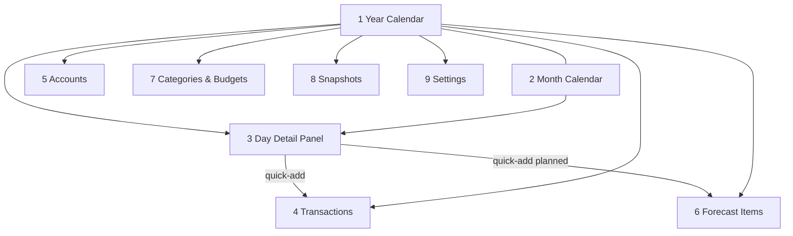

# Screen Specs — Phase 1

> **Sources:** [001-data-model.md](./001-data-model.md), [002-phase-1-scope.md §3](./002-phase-1-scope.md). Visual tokens, components, and semantic colors come from [004-style-guide.md](./004-style-guide.md) (pending).
>
> **Scope guard:** This doc specifies only the 9 locked Phase 1 screens plus a deferred **Insights** stub. No new entities are introduced — every field maps to [001-data-model.md](./001-data-model.md).

---

## 0. Conventions for this doc

| Convention | Meaning |
|---|---|
| **Reads / Writes** | Persisted entities (§3 of data model) the screen consumes or mutates |
| **Derived** | Engine output (§6 of data model: `ProjectionResult`, `ProjectionDay`, `ProjectionItem`) — never written by the screen |
| **States** | The empty / loading / error / populated variants every screen must implement |
| **Money** | Always displayed via locale formatter from `Settings`; stored as integer cents |
| **Dates** | Displayed per `Settings.dateFormat`; stored ISO `YYYY-MM-DD` |
| **i18n** | All labels are translation keys (pt-BR + en); no hardcoded strings |

**Global chrome (all screens):**
- Persistent left/top **nav** to the 9 screens (see §1 navigation map).
- **Calendar header strip** (working balance, next negative date, alert badge) is visible on calendar screens; other screens show a condensed version in the top bar.
- Locale + language switch lives in **Settings**, but the active language applies everywhere immediately.

---

## 1. Screen inventory & navigation

| # | Screen | Route (suggested) | Primary entity focus |
|---|---|---|---|
| 1 | Year Calendar | `/` | `ProjectionResult` (derived) |
| 2 | Month Calendar | `/month/:yyyy-mm` | `ProjectionDay[]` (derived) |
| 3 | Day Detail Panel | overlay `?day=YYYY-MM-DD` | `ProjectionDay` + quick-add |
| 4 | Transactions | `/transactions` | `Transaction` |
| 5 | Accounts | `/accounts` | `Account` |
| 6 | Forecast Items | `/forecast` | `PlannedItem` (+ `PlannedItemOverride`), `InstallmentPlan` (+ `Installment`) |
| 7 | Categories & Budgets | `/categories` | `Category` (+ `CategoryBudget`) |
| 8 | Snapshots | `/snapshots` | `Snapshot` (+ `SnapshotPayload`) |
| 9 | Settings | `/settings` | `Settings` |
| — | Insights (Phase 2 stub) | `/insights` | deferred |

> **Route alias:** `/installments` redirects to `/forecast` (Installments group). Former Screen 7 merged into Screen 6; data model unchanged.



Primary entry is **Year Calendar**. The Day Detail Panel is an overlay reachable from either calendar.

---

## 2. Cross-cutting patterns (used by multiple screens)

These are specified once and referenced by screens below.

### 2.1 Recurrence edit dialog (`this` / `this+future`)

Triggered whenever the user edits or deletes an occurrence of a recurring `PlannedItem`. → data-model §3.5.

| Choice | Effect |
|---|---|
| **This occurrence only** | Writes a `PlannedItemOverride(status = modified \| skipped)` for `occurrenceDate`. |
| **This and future** | Sets `endDate` on the current rule to the day before the edit date; creates a **new** `PlannedItem` from the edit date with new values. |

- No "all occurrences" option (locked decision).
- For a `once` item, the dialog is skipped (single occurrence edits in place).
- Deleting one occurrence → `PlannedItemOverride(status = skipped)`.

### 2.2 Settlement ("Mark as paid / settled")

Canonical link lives on the actual `Transaction` / `Installment`. → data-model §4.3.

| Forecast source | Settle action result |
|---|---|
| `PlannedItem` occurrence | Create/link `Transaction` with `settlesPlannedItemId` + `settlesPlannedOccurrenceDate` |
| `Installment` | Set `Installment.status = paid` + `settledTransactionId` |
| `CreditCardStatement` | Create transfer with `paysStatementId`; set `CreditCardStatement.paymentTransactionId` |

After settlement the projected occurrence is suppressed automatically; the actual takes its place in all derived views.

### 2.3 Quick-add (income / expense / transfer)

A compact form reused by the Day Panel and Transactions bulk entry.

| Field | Control | Notes |
|---|---|---|
| `type` | segmented (income / expense / transfer) | drives which fields show |
| `amountCents` | money input | positive only |
| `accountId` | account select | source for transfer |
| `toAccountId` | account select | shown only for transfer; cannot be a credit card unless settling a statement |
| `categoryId` | category select | required for income/expense; hidden for transfer |
| `effectiveDate` | date picker | defaults to selected day or today |
| `description` | text | optional memo |

Transfer to a credit card is only valid via the **statement payment** flow (§2.2), enforced by validation. → data-model §3.4 invariant.

### 2.4 Below-buffer semantics (red dot)

A day is flagged when `ProjectionDay.belowBuffer === true`, i.e. `closingBalanceCents < Settings.negativeBufferCents`. Used by both calendar screens and the header alert.

### 2.5 Large-outflow indicator (amber) — configurable

A day shows the amber indicator when `ProjectionDay.largeOutflow === true`, i.e. `Settings.largeOutflowThresholdCents > 0 && outflowsCents >= Settings.largeOutflowThresholdCents`. The threshold is user-configurable in Settings (default R$ 500); setting it to `0` disables the indicator entirely.

### 2.6 Month calendar day-entry text colors

Used on **Screen 2 — Month Calendar** only. Each day cell may show one or more **entry lines** (signed amounts for income/expense items affecting that day). Entry text color encodes whether the amount is **actual**, **projected**, or **past due** — distinct from the year-view dot indicators (§2.4, §2.5).

| Entry state | Text color | Token (Paper) | When it applies |
|---|---|---|---|
| **Actual income** | Strong green | `#15803d` | `amountCents > 0` from a settled `Transaction` or confirmed inflow on that day |
| **Projected income** | Light green | `#4ade80` | `amountCents > 0` from a projected `ProjectionItem` (`isProjected === true`) on a future date |
| **Actual outflow** | Dark warning | `#b45309` | `amountCents < 0` from a settled `Transaction` or confirmed outflow on that day |
| **Projected outflow** | Light warning | `#fbbf24` | `amountCents < 0` from a projected `ProjectionItem` on a future date |
| **Past due payment** | Strong red | `#dc2626` | Projected payment whose due date is **before today** and is not yet settled (`isProjected === true`, `effectiveDate < today`, unsettled) |

**Rules**
- A day should show as many as entry as possible; additional items are reachable via the Day Detail Panel.
- Closing balance in the cell remains neutral/muted; only entry amounts use the color rules above.
- Legend (toolbar) documents day-entry colors alongside year-style dot indicators and month-total projection notes.

**Derivation sketch** (per entry line, from `ProjectionDay.items[]`):

```
if item.isProjected && item.amountCents < 0 && item.effectiveDate < today && !item.isSettled:
  color = past-due
else if item.isProjected:
  color = projected-income | projected-outflow  (by sign)
else:
  color = actual-income | actual-outflow  (by sign)
```

---

## 3. Screen 1 — Year Calendar

**Purpose:** The hub. Answer "will my working balance go below buffer on any future day?" at a glance across a rolling 24-month horizon.

**Layout regions**
- **Header strip:** current working balance (`ProjectionResult.workingBalanceTodayCents`), next negative date (`nextNegativeDate`), alert badge when within `alertLeadTimeDays`.
- **Linear grid:** months as rows, weekdays as columns; weekend columns subtly banded. Horizontally scrollable across the horizon; "jump to today" control.
- **Legend:** red dot (below buffer), green (income day), amber (large outflow — net outflow ≥ `Settings.largeOutflowThresholdCents`), card-due marker.

**Day cell contents**
- Day number.
- **Red dot** if `belowBuffer`.
- Subtle indicators: net income day (green), large outflow (amber, `ProjectionDay.largeOutflow`), credit-card statement due (icon).

| Concern | Spec |
|---|---|
| **Reads** | — (none directly) |
| **Derived** | `ProjectionResult` → `days[]`, `nextNegativeDate`, `workingBalanceTodayCents` |
| **Writes** | — (read-only; edits happen via Day Panel) |
| **Actions** | Click day → open Day Detail Panel; toggle to Month view; jump to today; scroll horizon |
| **States** | **Empty:** no accounts yet → prompt to add an account/anchor. **Loading:** skeleton grid. **Error:** projection failed → retry + link to Settings. **Populated:** full grid |
| **Performance** | Respect NFR: recompute &lt; 500 ms; virtualize off-screen months |

---

## 4. Screen 2 — Month Calendar

**Purpose:** Denser single-month view for editing/reviewing, same projection data as the year view.

**Layout regions**
- Month grid (same weekday columns as year, one month) **or** list-by-day (open item, default month grid per scope §8).
- Month total strip: inflows, outflows, net, end-of-month projected balance.
- Prev/next month navigation; link back to Year view.
- **Legend:** year-style day indicators (§2.4, §2.5), **day-entry text colors** (§2.6), and month-total projection note.

**Day cell contents**
- Day number; optional today highlight.
- Closing balance (neutral text).
- Dot indicators (below buffer, income day, large outflow, card due) — same semantics as year view.

| Concern | Spec |
|---|---|
| **Derived** | `ProjectionDay[]` for the month; per-day `inflowsCents`/`outflowsCents`/`closingBalanceCents`; entry lines from `ProjectionDay.items[]` with actual/projected/past-due styling (§2.6) |
| **Writes** | — (edits via Day Panel / quick-add) |
| **Actions** | Click day → Day Panel; prev/next month; switch to year; quick-add from a day |
| **States** | Empty (no items this month → still show running balance from anchor); loading; error; populated |

---

## 5. Screen 3 — Day Detail Panel

**Purpose:** Slide-over from either calendar. Shows the full breakdown for one day and supports quick-add + settlement.

**Layout regions**
- **Header:** date, opening balance, closing balance, `belowBuffer` flag.
- **Item list:** every `ProjectionItem` affecting the day (actual + projected), grouped by source.
- **Quick-add** (§2.3).

**Item row contents** (`ProjectionItem`)

| Element | Source field |
|---|---|
| Description | `description` |
| Amount (signed) | `amountCents` |
| Account | `accountId` |
| Category | `categoryId` |
| Projected vs actual badge | `isProjected` |
| Source tag | `source` = transaction / planned / installment / statement_payment |

| Concern | Spec |
|---|---|
| **Derived** | One `ProjectionDay` (`openingBalanceCents`, `closingBalanceCents`, `items[]`, `belowBuffer`) |
| **Writes** | `Transaction` (quick-add, settlement); `PlannedItemOverride` (skip/modify a projected occurrence); `Installment.status` (mark paid) |
| **Actions** | Quick-add income/expense/transfer; mark a projected item settled (§2.2); skip/modify a planned occurrence (§2.1); open the underlying entity in its screen |
| **States** | Empty (no items → only opening = closing balance + quick-add); error on save → inline validation; populated |

---

## 6. Screen 4 — Transactions

**Purpose:** The actual ledger (replaces *Lançamentos*). Chronological, filterable, with running balance.

**Columns**

| Column | Field | Notes |
|---|---|---|
| Date | `effectiveDate` | sortable |
| Type | `type` | income/expense/transfer chip |
| Description | `description` | |
| Category | `categoryId` | blank for transfers |
| Account | `accountId` | source |
| To account | `toAccountId` | transfers only |
| Amount | `amountCents` | signed by type/leg |
| Running balance | derived | per selected account filter |
| Settles | `settlesPlannedItemId` / `settlesInstallmentId` / `paysStatementId` | link chip when set |

**Filters:** account, category, date range, type. **Bulk entry:** multi-row inline form (scope §8) reusing quick-add fields.

| Concern | Spec |
|---|---|
| **Reads / Writes** | `Transaction` (CRUD) |
| **Derived** | Per-account running balance (anchor + transactions) |
| **Actions** | Create/edit/delete; bulk-add; link/unlink settlement; filter; CSV import entry point (§13) |
| **Validation** | `toAccountId` required iff transfer; `categoryId` required for income/expense; transfer to card requires `paysStatementId` (§2.3) |
| **States** | Empty (no transactions → CSV import + add prompts); loading; error; populated with filters |

---

## 7. Screen 5 — Accounts

**Purpose:** Manage accounts, working flags, anchors, and credit-card cycle config.

**List row contents**

| Element | Field |
|---|---|
| Name | `name` |
| Type | `type` |
| Working? | `isWorking` toggle |
| Current balance | derived (anchor + activity); cards show **amount owed** (positive) |
| Anchor | `anchorBalanceCents` @ `anchorDate` |

**Account editor fields**

| Field | Shown when | Notes |
|---|---|---|
| `name`, `type`, `currency` | always | `currency` fixed to BRL |
| `isWorking` | always | default from `Settings.defaultWorkingForType` |
| `anchorBalanceCents`, `anchorDate` | always | re-anchorable (data-model §3.1) |
| `creditLimitCents` | type = credit_card | |
| `closingDay`, `dueDay` | type = credit_card | required; clamped 1–31 |
| `defaultPayFromAccountId` | type = credit_card | working account |
| `institution`, `agency`, `pixKey` | optional | metadata |

| Concern | Spec |
|---|---|
| **Reads / Writes** | `Account` (CRUD + archive via `archivedAt`) |
| **Side effects** | Creating/editing a credit card or changing its cycle **re-materializes statements** across the horizon; setting card `anchorBalanceCents` seeds the first due statement (data-model §3.7) |
| **Actions** | Add/edit/archive; toggle working; re-anchor (with confirmation that pre-anchor activity is excluded); configure card cycle |
| **States** | Empty (first-run → "add your first account" → drives onboarding); loading; error; populated |

---

## 8. Screen 6 — Forecast Items

**Purpose:** Unified home for all forecast-generating obligations: recurring planned items, one-off planned items (including **investment outflows**), and finite **installment debt** plans. No separate Installments, Subscriptions, or Investments screen — entities stay distinct in the data model (§3.5 vs §3.8).

**Layout regions**
- **Header strip:** working balance (condensed); primary actions **+ Add forecast item** and **+ Add installment plan**.
- **Summary strip (optional):** active item counts, subscription count, next inflow/outflow (derived).
- **Filter bar:** chip/toggle filters — **All**, **Subscriptions** (`PlannedItem.isSubscription = true`, applies within Recurring only), type (income/expense/transfer). Filters narrow rows within groups; they do not replace group structure.
- **List:** Active section, then Dormant section (`isActive = false` on either entity type).

**List grouping:** within Active / Dormant, three groups:

| Group | Contents | Entity |
|---|---|---|
| **Recurring** | `recurrence ∈ {weekly, monthly, yearly}` | `PlannedItem` |
| **One-off** | `recurrence = once` (includes investment transfer pattern) | `PlannedItem` |
| **Installments** | Finite debt with payoff date | `InstallmentPlan` (+ `Installment` rows) |

Subscriptions are **not** a separate group — they are recurring `PlannedItem`s tagged with `isSubscription = true`, surfaced via filter chip and row badge.

### PlannedItem rows (Recurring / One-off)

| Element | Source |
|---|---|
| Description | `description` |
| Type chip | `type` (income/expense/transfer) |
| Category | `categoryId` |
| Subscription badge | shown when `isSubscription = true` |
| Account | `accountId` (transfers: `accountId → toAccountId`) |
| Recurrence summary | derived from `recurrence`, `interval`, day/weekday/month fields |
| Next occurrence | derived next date + `amountCents` |
| Active | `isActive` toggle |

**Investment outflow pattern:** `type = transfer`, `recurrence = once`, `accountId = working`, `toAccountId = investment`. → data-model §7.

### InstallmentPlan rows (Installments group)

| Element | Source |
|---|---|
| Description | `description` |
| Per-installment amount | `installmentAmountCents` |
| Progress | paid count / `installmentCount` |
| Payoff date | derived `payoffDate` (installment #`installmentCount`) |
| Remaining | derived `remainingCount` |
| Next due | derived next unpaid `Installment.dueDate` + amount |
| Active | `isActive` toggle |

**Expanded schedule (per plan):** rows of `Installment` with `index`, `dueDate`, amount (`amountCentsOverride ?? plan amount`), `status` (`scheduled` / `paid` — green cell when paid), settle action (§2.2).

### PlannedItem editor fields

| Field | Control | Notes |
|---|---|---|
| `type` | income/expense/transfer | |
| `description` | text | |
| `amountCents` | money | default per occurrence |
| `accountId` | account select | card → accrues to statements |
| `toAccountId` | account select | transfer only; not a credit card |
| `categoryId` | category select | required for income/expense |
| `recurrence` | once/weekly/monthly/yearly | drives day/weekday/month fields; `once` → One-off group |
| `interval` | integer | every N periods |
| `dayOfMonth` / `weekday` / `monthOfYear` | conditional | weekday: 0 = Sun … 6 = Sat |
| `startDate`, `endDate` | date | endDate null = indefinite |
| `isSubscription` | toggle | semantic tag; filterable, not a separate list |
| `isActive` | toggle | dormant excluded from projection |
| Upcoming preview | read-only list | next N occurrences (Recurring only) |

### InstallmentPlan editor fields

| Field | Control | Notes |
|---|---|---|
| `description` | text | |
| `installmentAmountCents` | money | default per installment |
| `installmentCount` | integer | total installments |
| `firstDueDate` | date | installment #1 |
| `dayOfMonth` | integer? | subsequent due days; defaults from `firstDueDate` |
| `accountId` | account select | card → accrues to statements |
| `categoryId` | category select | optional |
| `isActive` | toggle | dormant excluded from projection |
| Schedule preview | expandable grid | eager `Installment` rows; inline paid toggle / amount override |

| Concern | Spec |
|---|---|
| **Reads / Writes** | `PlannedItem` (CRUD), `PlannedItemOverride` (per-occurrence); `InstallmentPlan` (CRUD, eager `Installment` generation), `Installment` (mark paid / override amount) |
| **PlannedItem actions** | Create/edit/delete with recurrence dialog (§2.1) when `recurrence ≠ once`; pause/resume (`isActive`); preview upcoming occurrences |
| **InstallmentPlan actions** | Create/edit plan; mark installment paid (§2.2); override one installment amount; pause/resume; activate dormant debt |
| **InstallmentPlan rules** | Eager rows on save; regeneration preserves paid/overridden rows; count cannot drop below highest paid index (data-model §3.8) |
| **States** | Empty (→ add forecast item or installment plan); loading; error; populated (active + dormant sections, three groups each) |

---

## 9. Screen 7 — Categories & Budgets

**Purpose:** Category CRUD (one-level hierarchy) + monthly **expense** budgets with current-month actual-vs-target, including parent roll-up. Also surfaces snapshot variance when a snapshot is selected.

**Category tree:** root categories with optional one-level children. `kind` = income/expense. Archive via `archivedAt`.

**Budget row** (per expense category, current month)

| Element | Source |
|---|---|
| Category | `Category.name` |
| Budget | active `CategoryBudget.amountCents` (latest `effectiveFromMonth <= M`, non-archived) |
| Actual | Σ expense `Transaction.amountCents` in category this month |
| Variance | budget − actual (rolls up to parent) |
| Progress | progress bar + over/under indicator |

**Budget editor:** `amountCents` + `effectiveFromMonth` (`YYYY-MM`). Budgets attach to **expense** categories only (data-model §3.3).

| Concern | Spec |
|---|---|
| **Reads / Writes** | `Category` (CRUD/archive), `CategoryBudget` (set/update with effective month) |
| **Derived** | Per-category month actuals; variance; parent roll-up; snapshot variance (when a snapshot is selected) |
| **Actions** | Add/edit/archive category; set/change budget; pick month; select snapshot to compare |
| **Validation** | Child's parent must be a root (`parentId = null`); transfers never categorized; budget only on expense categories |
| **States** | Empty (→ create first category); loading; error; populated (with/without snapshot overlay) |

---

## 10. Screen 8 — Snapshots

**Purpose:** Create baselines (full forecast clone) and compare baseline-vs-actual variance by category and month.

**List contents** (`Snapshot`): `name`, `asOfDate`, `horizonMonths`, `createdAt`.

**Compare view** (default side-by-side per scope §8): month table + category breakdown, over/under highlighting. Data read from `SnapshotPayload.summaryJson` (fast) and `payloadJson` (detail).

| Concern | Spec |
|---|---|
| **Reads / Writes** | `Snapshot` + `SnapshotPayload` (create, view, delete). Snapshots are **immutable** once created |
| **Derived** | Variance = snapshot baseline vs current actuals, by month and category |
| **Actions** | Create snapshot (name + asOfDate, captures current forecast); open compare; delete; feed selected snapshot into Categories & Budgets overlay |
| **States** | Empty (→ "create your first snapshot"); loading; error; populated (list + compare) |

---

## 11. Screen 9 — Settings

**Purpose:** Global configuration; export/backup. Single `Settings` row (`id = "singleton"`).

**Fields**

| Field | Control | Notes |
|---|---|---|
| `language` | pt-BR / en | applies immediately |
| `defaultCurrency` | display only | BRL (Phase 1) |
| `negativeBufferCents` | money | red-dot threshold; default 0 |
| `largeOutflowThresholdCents` | money | amber large-outflow threshold; default R$ 500; `0` disables |
| `horizonMonths` | integer | default 24 |
| `alertLeadTimeDays` | integer | in-app alert lead time |
| `defaultWorkingForType` | per-type toggles | defaults for new accounts |
| `dateFormat` | select | e.g. DD/MM/YYYY |

**Data section:** full JSON **export/backup** of all entities; (import covered in §13).

| Concern | Spec |
|---|---|
| **Reads / Writes** | `Settings` (update); triggers projection recompute on buffer/horizon change |
| **Actions** | Edit each setting; export all data (JSON); restore/import; trigger re-projection |
| **States** | Always populated (singleton); error on export/import shown inline |

---

## 12. CSV import (onboarding)

Lightweight bulk entry, reachable from Transactions and first-run empty states. Minimal 4-column template (scope §8): `date, description, amount, account`.

| Step | Behavior |
|---|---|
| Upload | Parse CSV; map columns to `Transaction` fields |
| Map | User confirms column → field mapping; account name → `accountId` |
| Validate | Flag rows with unknown account, bad date, or non-numeric amount |
| Commit | Insert valid rows as `Transaction`s; report skipped rows |

No schema impact — imports map to existing entities (data-model §9). Full Google Sheets import is **Phase 2**.

---

## 13. Insights (Phase 2 — stub only)

A single placeholder screen with a "coming in Phase 2" state. No data wiring. Present so navigation is stable; lists future capabilities (risk summaries, suggestions, NL queries) per [002-phase-1-scope.md §5](./002-phase-1-scope.md).

---

## 14. Global states & accessibility

| Concern | Requirement |
|---|---|
| Empty states | Every screen has a first-run empty state guiding the next action |
| Loading | Skeletons, not spinners, for grids/lists |
| Errors | Inline, actionable (retry / fix), never silent |
| Keyboard | Calendar grid is keyboard navigable (NFR baseline); forms fully tabbable |
| i18n | All copy via translation keys; numbers/dates/currency via locale formatter |
| Privacy | No telemetry; no network calls beyond local data (NFR §6) |

---

## 15. Traceability (screen → scope → entities)

| Screen | Scope ref | Primary entities / derived |
|---|---|---|
| Year Calendar | §2.9, §3.1 | `ProjectionResult` |
| Month Calendar | §2.9, §3.2 | `ProjectionDay[]` |
| Day Detail Panel | §2.9, §3.3 | `ProjectionDay`, `Transaction`, `PlannedItemOverride`, `Installment` |
| Transactions | §2.3, §3.4 | `Transaction` |
| Accounts | §2.2, §3.5 | `Account`, `CreditCardStatement` (side effect) |
| Forecast Items | §2.4, §2.6, §3.6 | `PlannedItem`, `PlannedItemOverride`, `InstallmentPlan`, `Installment` |
| Categories & Budgets | §2.7, §3.7 | `Category`, `CategoryBudget` |
| Snapshots | §2.7, §3.8 | `Snapshot`, `SnapshotPayload` |
| Settings | §2.1, §3.9 | `Settings` |
| Insights (stub) | §5 | — (Phase 2) |

---

## 16. Next documents

| Order | Document | Uses this spec for |
|---|---|---|
| 1 | [004-style-guide.md](./004-style-guide.md) | Calendar components, tokens, semantic colors for these screens |
| 2 | [005-prd.md](./005-prd.md) | User stories + acceptance criteria synthesized from these screens |

> This spec is intentionally visual-token-agnostic; semantic colors and layout tokens are defined in [004-style-guide.md](./004-style-guide.md).
