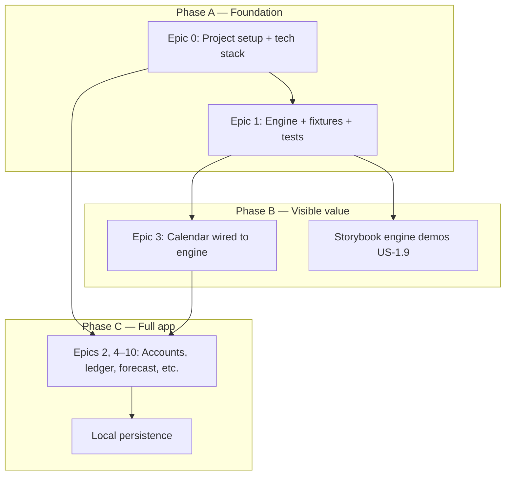
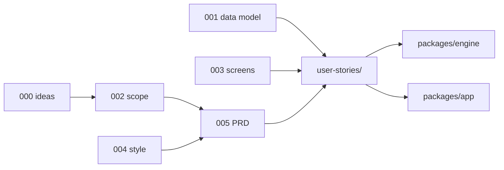

# PRD — Personal Cash Flow App (Phase 1)

> **Purpose:** Ratification document for what Phase 1 delivers and how we know it is done. Detailed acceptance criteria live in [`../user-stories/`](../user-stories/).
>
> **Sources:** [000-initial-ideas.md](../ideas/000-initial-ideas.md), [001-data-model.md](./001-data-model.md), [002-phase-1-scope.md](./002-phase-1-scope.md), [003-screen-specs.md](./003-screen-specs.md), [004-style-guide.md](./004-style-guide.md)

---

## 1. Problem statement

Personal cash flow is managed across **six disconnected spreadsheet tabs** with manual sync between the daily ledger and monthly forecast. Credit card billing cycles, installments, and recurring obligations make it hard to answer one question reliably:

> **Will my spendable money (working accounts) go negative on any future date?**

Phase 1 replaces that workflow with a **local-first web app** centered on a **linear year calendar**, backed by a **projection engine** that unifies accounts, actuals, planned items, credit cards, and installments.

---

## 2. Product vision

A personal cash flow forecasting app that projects **aggregate working-account balance** over a rolling 24-month horizon and surfaces risk **before** balance falls below a configurable buffer — using red-dot days on a print-inspired calendar (Paper theme).

**North-star metrics** (calendar header, not a separate dashboard):

- Current **working balance**
- **Next negative date** (first day below buffer)
- **In-app alert** when next negative date is within lead time

---

## 3. Goals & success criteria

| Goal | Success signal |
|---|---|
| Replace spreadsheet forecast + ledger sync | User can log actuals and see projection update without manual tab sync |
| Correct credit card semantics | Card purchase does not hit working cash until statement due date |
| Proactive risk visibility | Red dots and header match engine `belowBuffer` / `nextNegativeDate` |
| Data ownership | Full local storage + JSON export; no cloud account required |
| Implementable UI | React + Storybook components conform to locked Paper style guide |

---

## 4. Personas

### Primary — User (personal finance tracker)

- Manages BRL finances across checking, savings, credit cards, and installments
- Currently uses Google Sheets with six tabs (Lançamentos, Contas, Estudo de Gastos, etc.)
- Needs spreadsheet-level control with less manual reconciliation
- Single user; privacy and local-first storage are requirements

### Secondary — Developer (same person, builder hat)

- Needs engine-first development with **fixtures** to validate logic before persistence
- Wants **Storybook** to build calendar components against real `ProjectionResult` data
- Evaluates and locks tech stack before feature velocity

---

## 5. Scope summary

**In scope:** See [002-phase-1-scope.md](./002-phase-1-scope.md) — 9 screens, full data model, projection engine, snapshots, category budgets, CSV import, pt-BR + en.

**Out of scope (Phase 2):** What-if simulation, AI insights, full Google Sheets import, PWA offline, multi-currency.

---

## 6. Implementation strategy

Phase 1 is built **engine-first**, then **calendar**, then **CRUD + storage**.

**Rationale:** Projection logic (especially credit cards and recurrence) is the highest-risk work. Pure JS engine + fixtures de-risk the product before SQLite and React forms absorb complexity.

---

## 7. Tech stack (proposed — to be locked in US-0.1)

| Layer | Proposed choice | Notes |
|---|---|---|
| UI framework | **React** | Component model fits calendar grid + panels |
| Build | **Vite** | Fast dev for app + Storybook |
| Component dev | **Storybook** | Isolate Paper theme; engine fixture stories |
| Engine | **Plain JavaScript/TypeScript package** | Framework-agnostic; fully unit-testable |
| Styling | CSS modules + tokens from [004-style-guide.md](./004-style-guide.md) | Match `prototype/004/` |
| Storage | Local-first (TBD in US-0.1) | SQLite WASM, IndexedDB, or equivalent |
| Testing | **Vitest** (engine + units); Playwright optional later | Fixtures drive engine tests |
| i18n | react-i18next or similar | pt-BR + en |

Final decision documented when [US-0.1](../user-stories/00-foundation.md#us-01--evaluate-and-lock-the-phase-1-tech-stack) is complete.

---

## 8. User stories

All stories live in [`docs/user-stories/`](../user-stories/). Summary by epic:

| Epic | Title | Stories | Priority focus |
|---|---|---|---|
| **0** | [Foundation & tech stack](../user-stories/00-foundation.md) | US-0.1 – US-0.4 | P0 — start here |
| **1** | [Projection engine & fixtures](../user-stories/01-projection-engine.md) | US-1.1 – US-1.9 | P0 — engine + fixtures + tests |
| **2** | [Accounts](../user-stories/02-accounts.md) | US-2.1 – US-2.5 | P0 |
| **3** | [Calendar](../user-stories/03-calendar.md) | US-3.1 – US-3.7 | P0 |
| **4** | [Transactions](../user-stories/04-transactions.md) | US-4.1 – US-4.5 | P0 |
| **5** | [Forecast](../user-stories/05-forecast.md) | US-5.1 – US-5.5 | P0 |
| **6** | [Credit cards](../user-stories/06-credit-cards.md) | US-6.1 – US-6.4 | P0 |
| **7** | [Installments](../user-stories/07-installments.md) | US-7.1 – US-7.3 | P0 |
| **8** | [Categories & budgets](../user-stories/08-categories-budgets.md) | US-8.1 – US-8.3 | P0 |
| **9** | [Snapshots](../user-stories/09-snapshots.md) | US-9.1 – US-9.2 | P0 |
| **10** | [Settings & data](../user-stories/10-settings-data.md) | US-10.1 – US-10.3 | P0 |

**Total:** 44 user stories across 11 epics.

### Engine & fixtures (highlight)

These stories encode the engine-first approach:

- **US-1.1** — Engine input/output contract (`ProjectionResult`)
- **US-1.2 – US-1.6** — Core projection logic (anchors, planned, cards, installments, buffer)
- **US-1.7** — Named fixture library (`basic-salary-rent`, `credit-card-cycle`, etc.)
- **US-1.8** — Automated test suite per fixture
- **US-1.9** — Storybook visualization of fixture projections

### Foundation (highlight)

- **US-0.1** — Evaluate and lock stack (React + Storybook leading candidate)
- **US-0.2** — Monorepo: `packages/engine`, `packages/app`
- **US-0.3** — Storybook with Paper theme baseline
- **US-0.4** — Test + CI baseline

---

## 9. Screens (Phase 1)

No separate Dashboard or Investments screen. See [002-phase-1-scope.md §3](./002-phase-1-scope.md).

| # | Screen | Primary user stories |
|---|---|---|
| 1 | Year Calendar | US-3.1 – US-3.3 |
| 2 | Month Calendar | US-3.4 |
| 3 | Day Detail Panel | US-3.5 – US-3.6 |
| 4 | Transactions | US-4.1 – US-4.5 |
| 5 | Accounts | US-2.1 – US-2.5 |
| 6 | Forecast Items | US-5.1 – US-5.5, US-7.1 |
| 7 | Categories & Budgets | US-8.1 – US-8.3 |
| 8 | Snapshots | US-9.1 – US-9.2 |
| 9 | Settings | US-10.1 – US-10.3 |

Visual design: [004-style-guide.md](./004-style-guide.md) (Paper). Behavior: [003-screen-specs.md](./003-screen-specs.md).

---

## 10. Non-functional requirements

| Requirement | Target |
|---|---|
| Platform | Web app, local-first |
| Projection performance | Recompute &lt; 500 ms for typical dataset |
| Privacy | No telemetry; no LLM calls in Phase 1 |
| Data ownership | JSON export anytime |
| Accessibility | Baseline keyboard navigation for calendar (US-3.7) |
| Money | Integer cents, BRL-only |
| Horizon | Rolling 24 months |

---

## 11. Release definition (Phase 1 done when…)

Checklist inherited from [002-phase-1-scope.md §9](./002-phase-1-scope.md) and mapped to stories:

- [ ] **US-0.1 – US-0.4** — Project scaffold, stack locked, Storybook + tests run in CI
- [ ] **US-1.1 – US-1.8** — Engine passes fixture tests; credit card cycle verified
- [ ] **US-2.1 – US-2.4** — Accounts with anchors, working flags, card config
- [ ] **US-4.1 – US-4.4** — Ledger with settlement linking
- [ ] **US-5.1 – US-5.2** — Planned items + recurrence edit scopes
- [ ] **US-6.1 – US-6.4** — Statement UI + opening debt
- [ ] **US-7.1 – US-7.2** — Installment plans + paid status
- [ ] **US-3.1 – US-3.5** — Calendar shows engine-driven red dots and header metrics
- [ ] **US-8.1 – US-8.3** — Category budgets + actual vs target
- [ ] **US-9.1 – US-9.2** — Snapshots + variance
- [ ] **US-4.5** — CSV import
- [ ] **US-10.1 – US-10.3** — Settings, export, pt-BR + en
- [ ] **US-1.9** (P1) — Storybook engine demos (recommended before calling UI “done”)

---

## 12. Risks & mitigations

| Risk | Mitigation |
|---|---|
| Engine logic wrong → calendar misleading | Fixtures + tests (US-1.7, US-1.8); wire Storybook early (US-1.9) |
| Fixtures too simple vs real spreadsheet | Add fixture from actual sheet data; grow library over time |
| Tech stack churn | Lock in US-0.1 before broad UI work |
| Scope creep | [002-phase-1-scope.md](./002-phase-1-scope.md) is locked; Phase 2 items explicit |

---

## 13. Document traceability

---

## 14. Open questions

| # | Question | Owner | Status |
|---|---|---|---|
| 1 | Exact local storage technology (SQLite WASM vs IndexedDB) | Dev | Open — resolve in US-0.1 |
| 2 | Monorepo tool (npm workspaces vs pnpm vs turborepo) | Dev | Open — resolve in US-0.2 |
| 3 | Import/restore from JSON export in Phase 1? | Product | Open — export is P0; import optional |

---

## 15. Next steps

1. Review and ratify this PRD + user stories  
2. Execute **US-0.1** (stack ADR) and **US-0.2** (repo scaffold)  
3. Execute **US-1.1 – US-1.8** (engine + fixtures)  
4. Wire **US-1.9** + **US-3.1** (Storybook + year calendar on real projections)  
5. Layer persistence and remaining epics  
