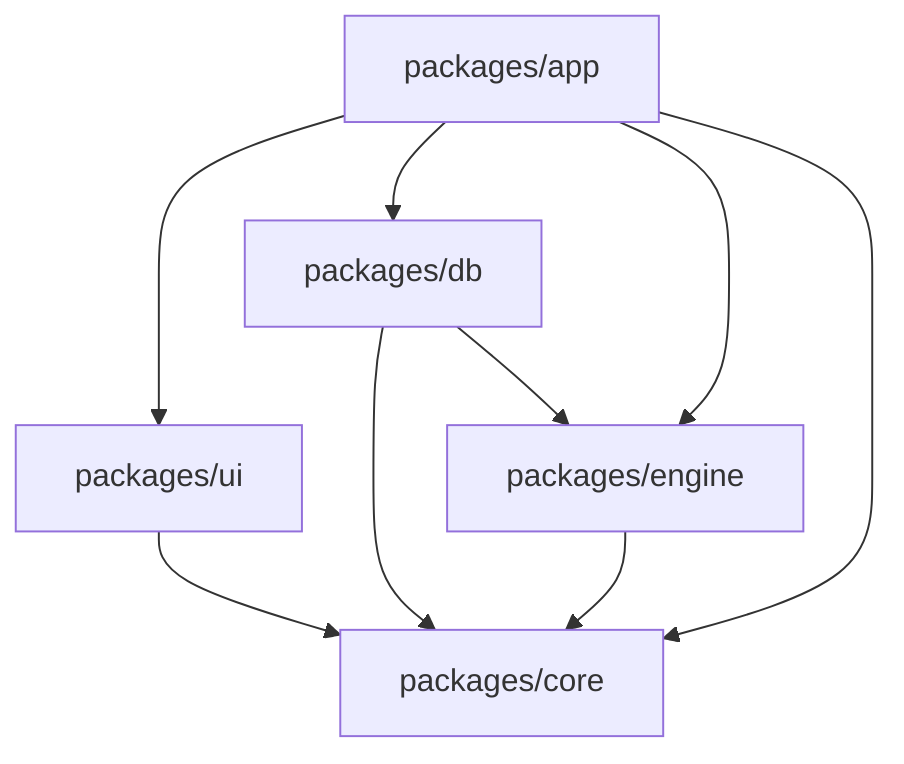
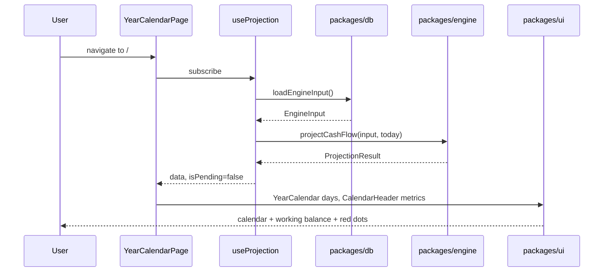
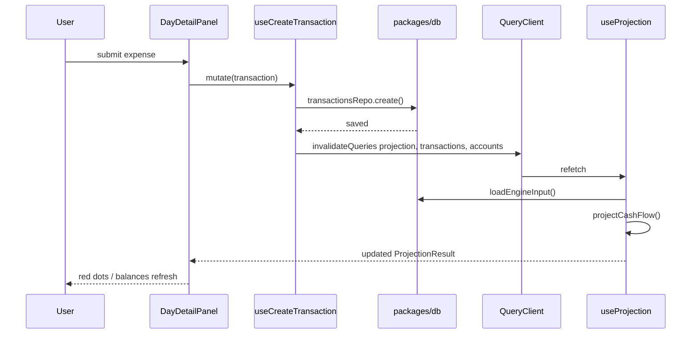
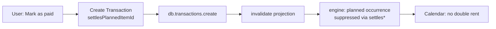
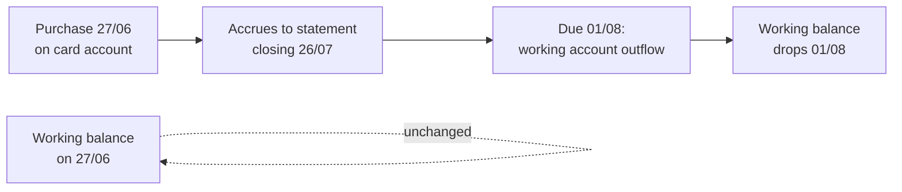
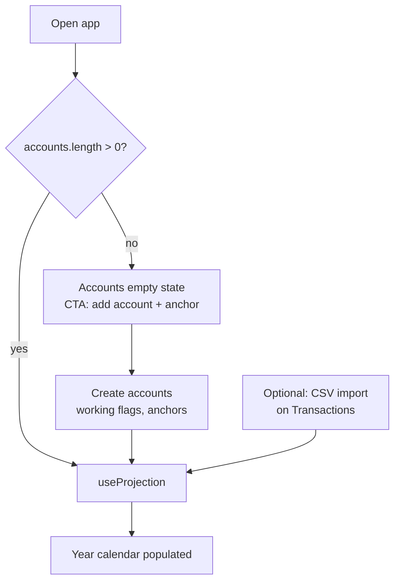

# Project Structure & Runtime Flow

> **Purpose:** Where code lives and how data moves at runtime. Complements [decisions/](../decisions/) (why) and [001-data-model.md](./001-data-model.md) (what entities exist).
>
> **Sources:** [ADR-001](../decisions/ADR-001-monorepo-react-vite.md), [ADR-004](../decisions/ADR-004-client-data-layer.md), [ADR-005](../decisions/ADR-005-tanstack-router.md), [US-0.2](../user-stories/00-foundation.md#us-02--initialize-the-application-monorepo)

---

## 1. Top-level repository layout

```text
cashflow/
├── docs/                    # Specs, PRD, user stories, ADRs, UI prototypes (reference — not imported by app)
│   ├── prototype/           # Static HTML/CSS UI reference (004 = Paper canonical)
│   ├── specs/
│   ├── user-stories/
│   └── decisions/
├── packages/                # All runnable TypeScript code
│   ├── core/                # Shared types, formatters, constants
│   ├── engine/              # Pure projection — projectCashFlow()
│   ├── db/                  # Client persistence + repos + loadEngineInput()
│   ├── ui/                  # React components, CSS modules, Storybook
│   └── app/                 # Vite SPA — routes, pages, TanStack Query hooks
├── tooling/                 # Shared eslint, tsconfig bases (optional)
├── .github/workflows/       # CI — lint, test, build
├── package.json             # pnpm workspaces root
├── pnpm-workspace.yaml
└── README.md                # dev / test / storybook commands
```

**Rules**

| Folder | Imported by app? |
|---|---|
| `docs/` | No |
| `docs/prototype/` | No — port patterns into `packages/ui`, do not import files |
| `packages/*` | Yes — via workspace protocol (`workspace:*`) |

---

## 2. Package dependency graph



| Package | May import | Must not import |
|---|---|---|
| `core` | — | `app`, `ui`, `db`, `engine` |
| `engine` | `core` | React, TanStack, `db`, `ui`, `app` |
| `db` | `core`, `engine` (materialize only, if needed) | React, TanStack |
| `ui` | `core` | `app`, `db`, TanStack Query |
| `app` | all packages | — |

**TanStack Query and TanStack Router** live only in `packages/app`.

---

## 3. Package internals

### 3.1 `packages/core/`

Shared contract from [001-data-model.md](./001-data-model.md).

```text
packages/core/
├── src/
│   ├── entities/           # Account, Transaction, PlannedItem, …
│   ├── projection.ts       # EngineInput, ProjectionResult, ProjectionDay
│   ├── settings.ts
│   └── format/
│       ├── money.ts        # formatMoney(cents, locale)
│       └── dates.ts
└── package.json
```

### 3.2 `packages/engine/`

Synchronous, pure, fully unit-tested. **Build first.**

```text
packages/engine/
├── src/
│   ├── index.ts            # export projectCashFlow
│   ├── project.ts
│   ├── expand/             # recurrence → dated events
│   ├── cards/              # statement assignment, due payments
│   └── balance/            # per-account + aggregate working
├── fixtures/
│   ├── basic-salary-rent.json
│   ├── credit-card-cycle.json
│   ├── installment-plan.json
│   └── README.md           # expected nextNegativeDate per fixture
├── src/project.test.ts
└── package.json
```

### 3.3 `packages/db/`

Async persistence; no React. Backend: Dexie or SQLite WASM ([ADR-006](../decisions/ADR-006-client-storage.md)).

```text
packages/db/
├── src/
│   ├── index.ts            # public API: repos, loadEngineInput, exportAll
│   ├── client.ts           # open DB
│   ├── repos/
│   │   ├── accounts.ts
│   │   ├── transactions.ts
│   │   └── …
│   ├── materialize/        # statements, eager installments (on write)
│   ├── loadEngineInput.ts  # Promise.all repos → EngineInput
│   └── export-import/
└── package.json
```

### 3.4 `packages/ui/`

Presentational components + Storybook. CSS Modules + `tokens/paper.css`.

```text
packages/ui/
├── .storybook/
│   ├── main.ts
│   └── preview.ts          # imports paper.css
├── src/
│   ├── tokens/
│   │   └── paper.css       # from 004-style-guide / docs/prototype/004
│   ├── atoms/              # Button, Chip, Indicator, …
│   ├── molecules/          # CalendarDayCell, …
│   ├── organisms/          # AppStatus, YearCalendar, …
│   ├── templates/          # layout scaffolds
│   ├── pages/              # fixture-driven Storybook pages (US-1.9)
│   └── index.ts
└── package.json
```

Component taxonomy: [ADR-007](../decisions/ADR-007-storybook-vitest.md).

### 3.5 `packages/app/`

Thin shell: routing, Query hooks, pages.

```text
packages/app/
├── src/
│   ├── main.tsx
│   ├── routes/             # TanStack Router route tree
│   ├── pages/
│   │   ├── YearCalendarPage/
│   │   ├── MonthCalendarPage/
│   │   ├── TransactionsPage/
│   │   └── …               # 9 screens per 003-screen-specs
│   ├── data/
│   │   ├── queryClient.ts
│   │   ├── keys.ts
│   │   ├── queries/        # useProjection, useAccounts, …
│   │   └── mutations/      # useCreateTransaction, …
│   ├── layout/
│   │   ├── AppShell.tsx
│   │   ├── Nav.tsx
│   │   └── CalendarHeader.tsx
│   └── i18n/
├── index.html
└── package.json
```

---

## 4. Runtime layers (mental model)

```text
┌─────────────────────────────────────────────────────────────┐
│  packages/app          TanStack Router + TanStack Query     │
│  Pages, hooks (useProjection, useCreateTransaction)         │
└───────────────────────────┬─────────────────────────────────┘
                            │ async read / write
┌───────────────────────────▼─────────────────────────────────┐
│  packages/db             Repos + loadEngineInput()            │
│  Dexie / SQLite WASM — all entities on device               │
└───────────────────────────┬─────────────────────────────────┘
                            │ plain objects in memory
┌───────────────────────────▼─────────────────────────────────┐
│  packages/engine         projectCashFlow(input) → Result    │
│  sync, pure — no I/O                                        │
└─────────────────────────────────────────────────────────────┘
         ▲
         │ types
┌────────┴────────┐
│  packages/core  │
└─────────────────┘

packages/ui ← receives props from app pages (no Query inside components)
```

**Projection is never persisted.** Query `queryFn` loads entities → engine runs → UI renders `ProjectionResult`.

---

## 5. Typical user flows

### 5.1 App open — year calendar (read path)

**User:** Opens app → lands on Year Calendar → sees working balance, red dots, next negative date.



**States**

| Query state | UI |
|---|---|
| `isPending` | Calendar skeleton |
| `isError` | Error panel |
| `data` + no accounts | Onboarding empty (app logic) |
| `data` + accounts | Full calendar |

---

### 5.2 Add expense from day panel (write path)

**User:** Clicks a day → Day Detail Panel → quick-add expense → calendar updates.



No `useEffect` for sync — mutation `onSuccess` invalidates query keys ([ADR-004](../decisions/ADR-004-client-data-layer.md)).

---

### 5.3 Mark planned rent as paid (settlement)

**User:** Forecast item “Rent day 10” → mark settled → links actual transaction → projection suppresses future occurrence.



Canonical link on `Transaction` per [001-data-model.md §4.3](./001-data-model.md).

---

### 5.4 Credit card purchase (engine semantics)

**User:** Logs R$ 200 on Cartão Cora (closing 26, due 01).



UI writes a card **expense** transaction; engine + statement materialization handle accrual ([ADR-004](../decisions/ADR-004-client-data-layer.md), engine US-1.4).

---

### 5.5 First visit / onboarding (empty → data)



---

## 6. Query keys (app convention)

Centralized in `packages/app/src/data/keys.ts`:

| Key | Used by |
|---|---|
| `['settings']` | Settings page |
| `['accounts']` | Accounts list, header |
| `['transactions', filters]` | Ledger |
| `['projection', asOfDate]` | Year + Month calendar, header |
| `['categories']`, `['budgets']` | Categories & Budgets |
| `['snapshots']` | Snapshots |

**Rule:** any mutation that changes entities feeding the engine must invalidate `['projection']` (and relevant entity keys).

---

## 7. What stays outside `packages/`

| Path | Role |
|---|---|
| `docs/specs/` | Behavior specs — implementation must conform |
| `docs/decisions/` | ADRs — stack rationale |
| `docs/user-stories/` | Acceptance criteria backlog |
| `docs/prototype/004/` | Visual reference for Paper theme |

---

## 8. Root scripts (target)

```json
{
  "scripts": {
    "dev": "pnpm --filter @cashflow/app dev",
    "build": "pnpm -r build",
    "test": "pnpm -r test",
    "test:engine": "pnpm --filter @cashflow/engine test",
    "storybook": "pnpm --filter @cashflow/ui storybook"
  }
}
```

---

## 9. Build order

1. `core` — types from data model  
2. `engine` + fixtures + tests  
3. `ui` — tokens, Storybook, calendar components (fixture stories)  
4. `app` — router + Query + year calendar on engine  
5. `db` — repos behind interface; wire `loadEngineInput`  
6. Remaining pages and mutations  

---

## 10. Anti-patterns

| Don't | Do instead |
|---|---|
| Import `docs/prototype/` in app | Port CSS/components to `packages/ui` |
| Put projection math in React hooks | `projectCashFlow` in `engine` |
| Persist `ProjectionResult` in db | Derive via Query on each invalidation |
| TanStack Query inside `ui` or `db` | Query hooks in `app` only |
| `useEffect` to refetch after save | `mutation` + `invalidateQueries` |

---

## 11. Traceability

| Topic | Document |
|---|---|
| Stack choices | [decisions/](../decisions/) |
| Entities & projection types | [001-data-model.md](./001-data-model.md) |
| Screens & routes | [003-screen-specs.md](./003-screen-specs.md) |
| US-0.2 acceptance | [00-foundation.md](../user-stories/00-foundation.md) |
