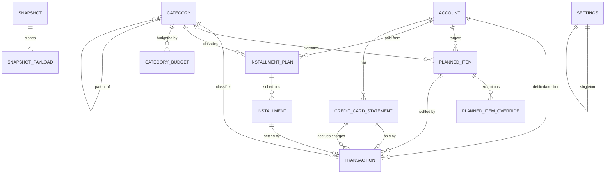
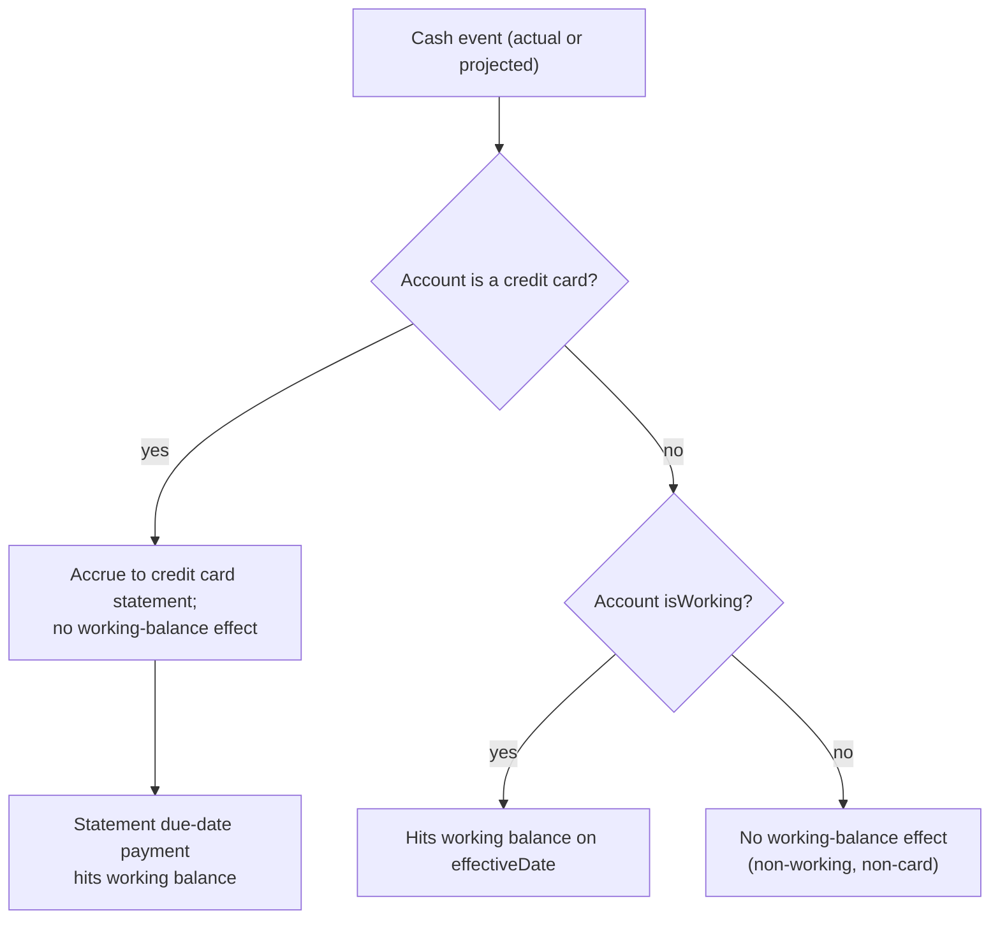

# Data Model / Schema

> Companion to `docs/ideas/initial-ideas.md`. Every decision in §9 of that doc is reflected here. Where a field encodes a decision, it is annotated with `→ decision`.

---

## 1. Conventions

| Concern | Rule |
|---|---|
| **IDs** | String UUID (v4) or CUID, generated client-side (local-first). Field name `id`. Foreign keys named `<entity>Id`. |
| **Money** | Integer **cents** (BRL). Field suffix `Cents`. Never floats. → *Money & currency precision* |
| **Currency** | `BRL` only in Phase 1; a `currency` field exists for forward-compat but is always `"BRL"`. → *Currency* |
| **Dates** | Calendar dates stored as ISO `YYYY-MM-DD` (no time, no timezone) for anything cash-flow-affecting (`effectiveDate`, `dueDate`, anchors). Audit timestamps (`createdAt`/`updatedAt`) are full ISO‑8601 UTC datetimes. |
| **Soft delete** | Entities the user can retire use `archivedAt` (nullable datetime) instead of hard delete, to preserve historical projections/snapshots. |
| **Audit** | All persisted entities carry `createdAt` and `updatedAt`. Omitted from field tables below for brevity unless meaningful. |
| **Enums** | Stored as lowercase snake_case strings. Listed in §5. |
| **Storage** | Local-first (SQLite or equivalent). Tables map 1:1 to entities below. → *Storage / architecture* |

**Persisted vs derived:** Entities in §3 are *stored*. Types in §6 (projection day, working balance, statement totals) are *computed by the engine* and not persisted, except where explicitly materialized (credit card statements, snapshots).

---

## 2. Entity-Relationship Overview



**Reading the model:** `Account` is the hub. Everything that moves money references an account and (optionally) a category. Forecast-generating entities are `PlannedItem` (recurring + one-off + subscriptions) and `InstallmentPlan` (finite debt). Actuals live in `Transaction`. The engine reconciles them into projected daily balances.

---

## 3. Entities

### 3.1 Account

A financial container with a balance anchor. Covers banks, wallets, credit cards, and investment accounts.

| Field | Type | Notes |
|---|---|---|
| `id` | string | PK |
| `name` | string | "Cora", "Cartão Cora", "Nubank Poupança" |
| `type` | enum `AccountType` | `checking`, `savings`, `wallet`, `credit_card`, `investment` |
| `currency` | string | Always `"BRL"` in Phase 1 |
| `isWorking` | boolean | Counted toward aggregate working balance. → *Negative detection scope* |
| `anchorBalanceCents` | integer | Opening balance at `anchorDate`. → *Account anchoring* |
| `anchorDate` | date | Origin date for forward projection. Re-anchorable. → *Account anchoring* |
| `creditLimitCents` | integer? | Credit cards only |
| `closingDay` | integer? | Credit cards only, 1–31. Statement closing day (fechamento). → *Card payment cycle* |
| `dueDay` | integer? | Credit cards only, 1–31. Statement due day (vencimento). → *Card payment cycle* |
| `defaultPayFromAccountId` | string? | Credit cards only: working account that pays statements by default |
| `institution` | string? | Optional metadata (bank name) |
| `agency` | string? | Optional metadata |
| `pixKey` | string? | Optional metadata |
| `sortOrder` | integer | Display ordering |
| `archivedAt` | datetime? | Soft delete |

**Invariants**
- `type = credit_card` ⇒ `isWorking = false`, `closingDay` and `dueDay` required. **`anchorBalanceCents` is always positive = amount owed** (e.g. R$ 1.500 fatura → `150000`). The engine treats cards as liabilities via `account.type`, not via negative numbers. → *§8.1*
- `type = investment` ⇒ typically `isWorking = false` (configurable).

> **Day-of-month edge case:** `closingDay`/`dueDay`/any `dayOfMonth` of 29–31 must clamp to the last valid day in shorter months (e.g. 31 → 28/29 Feb). Engine rule, applies everywhere a day-of-month is used.

### 3.2 Category

Classification for reporting and budgets. **One level of nesting only** — a child may have a parent, but the parent must be a root category (`parentId = null`). → *§8.5*

| Field | Type | Notes |
|---|---|---|
| `id` | string | PK |
| `name` | string | Stored as i18n key or free text; display translated. e.g. `category.housing` |
| `kind` | enum `CategoryKind` | `income`, `expense` |
| `parentId` | string? | Optional **root** parent only (parent's own `parentId` must be null) |
| `color` | string? | Hex, for calendar/report accents |
| `sortOrder` | integer | |
| `archivedAt` | datetime? | Soft delete |

> Transfers are **not** categorized (net worth unchanged); `categoryId` is null for transfers.

**Invariants**
- If `parentId` is set, the referenced category must have `parentId = null` (no grandchildren).
- Budgets attach to any category (root or child); variance rolls up to parent in reports.

### 3.3 CategoryBudget

Monthly target per category. → *Category budgets (Phase 1)*. Modeled with an effective month so a budget can change over time without losing history.

| Field | Type | Notes |
|---|---|---|
| `id` | string | PK |
| `categoryId` | string | FK → Category |
| `amountCents` | integer | Monthly target |
| `effectiveFromMonth` | string | `YYYY-MM`; applies from this month onward until superseded |
| `archivedAt` | datetime? | |

**Resolution:** the active budget for a category in month *M* is the row with the latest `effectiveFromMonth <= M`. Variance = budget − Σ actual expenses in that category that month.

### 3.4 Transaction (actual ledger — replaces *Lançamentos*)

A confirmed money event. Income, expense, or transfer. **Single-row transfer model:** one row with `accountId` (source) + `toAccountId` (destination); the engine applies both legs. → *§8.3*

| Field | Type | Notes |
|---|---|---|
| `id` | string | PK |
| `type` | enum `TxType` | `income`, `expense`, `transfer` |
| `amountCents` | integer | Always positive; sign derived from `type` + leg |
| `accountId` | string | Primary account. Income → credited; expense → debited; transfer → **source** |
| `toAccountId` | string? | Transfer **destination** (required iff `type = transfer`) |
| `categoryId` | string? | Required for income/expense; null for transfer |
| `description` | string | Free-text memo |
| `effectiveDate` | date | When it affects cash flow |
| `settlesPlannedItemId` | string? | Links this actual to a forecast occurrence (see §4.3) |
| `settlesPlannedOccurrenceDate` | date? | Which occurrence of the rule it settles |
| `settlesInstallmentId` | string? | Links this actual to a specific installment |
| `paysStatementId` | string? | Set when this transfer is a credit-card statement payment |
| `createdAt` / `updatedAt` | datetime | |

**Effect on working balance (engine rule):**
- `expense`/`income` on a **working** account → hits aggregate working balance on `effectiveDate`.
- `expense` on a **credit card** account → accrues to a statement; does **not** hit working balance directly (see §3.7).
- `transfer` between two working accounts → net working balance unchanged.
- `transfer` working → non-working (investment/card payment) → working balance decreases.

### 3.5 PlannedItem (forecast template — replaces *Estudo de Gastos*, subscriptions)

Unified entity for **one-off planned** items and **recurring** rules (recurring obligations + subscriptions). Generates virtual occurrences within the horizon; occurrences are not persisted (except overrides and settlements).

| Field | Type | Notes |
|---|---|---|
| `id` | string | PK |
| `type` | enum `TxType` | `income`, `expense`, `transfer` |
| `amountCents` | integer | Default amount per occurrence |
| `accountId` | string | Target account (source for transfer). If a **credit card**, occurrences accrue to statements |
| `toAccountId` | string? | Transfer destination |
| `categoryId` | string? | Required for income/expense |
| `description` | string | |
| `recurrence` | enum `Recurrence` | `once`, `weekly`, `monthly`, `yearly` |
| `interval` | integer | Every N periods (default 1); e.g. monthly interval 2 = every other month |
| `dayOfMonth` | integer? | For monthly/yearly: due day (1–31, clamped) |
| `weekday` | integer? | For weekly: 0–6 |
| `monthOfYear` | integer? | For yearly: 1–12 |
| `startDate` | date | First occurrence date. For `once`, the single date |
| `endDate` | date? | Last possible occurrence (null = indefinite). Set when splitting "this and future" |
| `isSubscription` | boolean | Recurring obligation charged to a card/account. → semantic tag |
| `isActive` | boolean | Paused subscriptions/dormant items excluded from projection when false. → *Dormant debt* |
| `archivedAt` | datetime? | |

**Recurrence editing → decision *This / This+future*:**
- **This occurrence only** → write a `PlannedItemOverride` (§3.6) for that date (modified amount, skip, or settled link).
- **This and future** → set `endDate` on the existing rule to the day before the edit date, and create a **new** PlannedItem starting at the edit date with the new values. (No whole-series "all" edit.)

### 3.6 PlannedItemOverride (per-occurrence exception)

| Field | Type | Notes |
|---|---|---|
| `id` | string | PK |
| `plannedItemId` | string | FK → PlannedItem |
| `occurrenceDate` | date | The original scheduled date this override targets |
| `status` | enum `OverrideStatus` | `modified`, `skipped`, `settled` |
| `amountCentsOverride` | integer? | New amount if `modified` |
| `dateOverride` | date? | Moved to a different date |
| `settledTransactionId` | string? | Set when `settled` (links to the actual that fulfilled it) |
| `note` | string? | |

> Uniqueness: one override per (`plannedItemId`, `occurrenceDate`).

### 3.7 CreditCardStatement (materialized billing cycle)

One row per card per billing cycle, maintained by the engine from the card's `closingDay`/`dueDay`. Materialized (not purely derived) so the user can override the payment amount/date and link the actual payment. → *Card payment cycle*, *Card payment amount*.

| Field | Type | Notes |
|---|---|---|
| `id` | string | PK |
| `cardAccountId` | string | FK → Account (type = credit_card) |
| `periodStart` | date | Day after previous closing date |
| `closingDate` | date | This cycle's closing date |
| `dueDate` | date | First due day after `closingDate` |
| `computedTotalCents` | integer | Σ of charges (actual + projected) with `effectiveDate` in `(periodStart..closingDate]` |
| `plannedPaymentCents` | integer? | Override of payment amount; null ⇒ pay full `computedTotalCents`. → partial payment |
| `payFromAccountId` | string? | Override of which working account pays; null ⇒ card's `defaultPayFromAccountId` |
| `status` | enum `StatementStatus` | `open`, `closed`, `paid` |
| `paymentTransactionId` | string? | The actual transfer (working → card) that paid it |

**Engine rules**
- **Materialization:** all statements within the projection horizon (`Settings.horizonMonths`, default 24) are pre-created per card when the card is created or its cycle config changes. → *§8.4*
- A charge (actual `Transaction` or projected `PlannedItem`/`Installment` occurrence) whose `accountId` is a credit card is assigned to the statement whose `(periodStart..closingDate]` window contains its `effectiveDate`.
- The statement creates a **projected working-account outflow** of `plannedPaymentCents ?? computedTotalCents` on `dueDate`, drawn from `payFromAccountId ?? card.defaultPayFromAccountId`.
- This outflow is what affects aggregate working balance — individual card charges never do.

### 3.8 InstallmentPlan (finite debt — replaces part of *Estudo de Contas parceladas*)

Finite series with an auto-computed payoff date. Distinct from PlannedItem because of first-class installment counting and per-installment paid status.

| Field | Type | Notes |
|---|---|---|
| `id` | string | PK |
| `description` | string | "Ipanema", "BB Ativos" |
| `accountId` | string | Account charged. If a **credit card**, installments accrue to statements; if working, drain working directly |
| `categoryId` | string? | |
| `installmentAmountCents` | integer | Per-installment amount (assumes equal; see override) |
| `installmentCount` | integer | Total number of installments |
| `firstDueDate` | date | Date of installment #1 |
| `dayOfMonth` | integer? | Due day for subsequent installments (defaults from `firstDueDate`) |
| `isActive` | boolean | `false` = dormant/deferred debt, excluded from projection. → *Dormant debt* |
| `archivedAt` | datetime? | |

**Derived:** `payoffDate` = date of installment #`installmentCount`; `remainingCount` = unpaid installments from today.

**On save:** creating or updating a plan eagerly generates all `Installment` rows (1..`installmentCount`). Regenerating preserves rows with `status = paid` or `amountCentsOverride` set.

### 3.9 Installment (single scheduled payment)

Materialized per installment so each can carry an amount override and a paid/settled status (the "green cell" pattern).

| Field | Type | Notes |
|---|---|---|
| `id` | string | PK |
| `installmentPlanId` | string | FK → InstallmentPlan |
| `index` | integer | 1..installmentCount |
| `dueDate` | date | |
| `amountCentsOverride` | integer? | Null ⇒ plan's `installmentAmountCents` |
| `status` | enum `InstallmentStatus` | `scheduled`, `paid` |
| `settledTransactionId` | string? | Actual transaction that paid it. → *Installment status: paid* |

> **Eager generation:** all `Installment` rows (`installmentCount` total) are created when the plan is saved. Supports per-installment paid status with simple queries. → *§8.2*

### 3.10 Snapshot (baseline) + SnapshotPayload

Frozen full clone of the forecast state for baseline-vs-actual variance. → *Snapshot granularity: full forecast clone*.

| Field (Snapshot) | Type | Notes |
|---|---|---|
| `id` | string | PK |
| `name` | string | "Início de Junho 2026" |
| `asOfDate` | date | The forecast's reference date |
| `horizonMonths` | integer | Horizon captured (default 24) |
| `createdAt` | datetime | |

| Field (SnapshotPayload) | Type | Notes |
|---|---|---|
| `id` | string | PK |
| `snapshotId` | string | FK → Snapshot |
| `payloadJson` | json | Full clone: account anchors, planned items, installments, statements, and the computed projected daily balances at snapshot time |
| `summaryJson` | json | Precomputed per-month and per-category totals for fast variance views |

> Stored as a denormalized blob on purpose — snapshots are immutable historical records and must not change when live data changes.

### 3.11 Settings (singleton)

| Field | Type | Notes |
|---|---|---|
| `id` | string | Always `"singleton"` |
| `language` | enum | `pt-BR`, `en` |
| `defaultCurrency` | string | `BRL` |
| `negativeBufferCents` | integer | Red-dot threshold; default `0`. → *Negative threshold (configurable buffer)* |
| `horizonMonths` | integer | Default `24`. → *Horizon length (rolling 24 months)* |
| `alertLeadTimeDays` | integer | Days before next-negative-date to warn. → *Alerts: proactive* |
| `defaultWorkingForType` | json | Map of `AccountType` → default `isWorking` for new accounts |
| `dateFormat` | string | Locale formatting (e.g. `DD/MM/YYYY`) |

---

## 4. Cross-Cutting Models

### 4.1 What hits the aggregate working balance (single source of truth)



Transfers are evaluated per leg with the same rule (source leg = outflow, destination leg = inflow); a transfer between two working accounts nets to zero.

### 4.2 Forecast occurrence generation

The engine expands generative entities into dated occurrences within `[today, today + horizonMonths]`:
1. `PlannedItem` (where `isActive`) → occurrences by `recurrence`/`interval`/`startDate`/`endDate`, minus `skipped` overrides, with `modified`/`dateOverride` applied.
2. `InstallmentPlan` (where `isActive`) → its `Installment` rows with `status = scheduled` (paid ones excluded).
3. Credit-card statements → due-date payment outflows.
Occurrences with a matching settlement (override `settled` or a `Transaction.settles*`) are replaced by the actual to avoid double counting.

### 4.3 Settlement / linking (planned ↔ actual — replaces manual sheet sync)

A projected item becomes real in one of two ways:
- **Mark settled**: create an actual `Transaction` and set its `settlesPlannedItemId` + `settlesPlannedOccurrenceDate` (or `settlesInstallmentId`, or `paysStatementId`). The engine then suppresses the projected occurrence and uses the actual.
- **Override settled**: a `PlannedItemOverride(status = settled, settledTransactionId)` records the link without changing the rule.

This is the structural replacement for the manual sync between *Estudo de Gastos* and *Lançamentos*.

---

## 5. Enumerations

| Enum | Values |
|---|---|
| `AccountType` | `checking`, `savings`, `wallet`, `credit_card`, `investment` |
| `CategoryKind` | `income`, `expense` |
| `TxType` | `income`, `expense`, `transfer` |
| `Recurrence` | `once`, `weekly`, `monthly`, `yearly` |
| `OverrideStatus` | `modified`, `skipped`, `settled` |
| `StatementStatus` | `open`, `closed`, `paid` |
| `InstallmentStatus` | `scheduled`, `paid` |
| `Language` | `pt-BR`, `en` |

---

## 6. Derived Types (engine output — not persisted)

```ts
// One entry per calendar day across the horizon.
interface ProjectionDay {
  date: string;                 // YYYY-MM-DD
  openingBalanceCents: number;  // aggregate working balance at start of day
  inflowsCents: number;
  outflowsCents: number;
  closingBalanceCents: number;
  belowBuffer: boolean;         // closingBalanceCents < settings.negativeBufferCents
  items: ProjectionItem[];      // actual + projected events affecting this day
}

interface ProjectionItem {
  source: "transaction" | "planned" | "installment" | "statement_payment";
  refId: string;
  type: TxType;
  amountCents: number;          // signed against working balance
  accountId: string;
  categoryId?: string;
  description: string;
  isProjected: boolean;         // false = settled actual
}

interface ProjectionResult {
  days: ProjectionDay[];
  nextNegativeDate: string | null;  // first day where belowBuffer === true
  workingBalanceTodayCents: number;
}
```

---

## 7. Worked Examples (spreadsheet → schema)

**Salary on day 5** → `PlannedItem { type: income, recurrence: monthly, dayOfMonth: 5, accountId: <working>, categoryId: salary }`.

**Rent on day 10** → `PlannedItem { type: expense, recurrence: monthly, dayOfMonth: 10 }`.

**Netflix on Cartão Cora** → `PlannedItem { type: expense, recurrence: monthly, dayOfMonth: 15, accountId: <Cartão Cora>, isSubscription: true }`. The charge accrues to the card statement; working balance is only touched when that statement's `dueDate` payment is projected.

**Credit-card cycle (closing 26 / due 01)** → card `Account { closingDay: 26, dueDay: 1 }`. A purchase on 27/06 lands on the statement closing 26/07, paid 01/08 from `defaultPayFromAccountId`. Modeled as `CreditCardStatement { closingDate: 2026-07-26, dueDate: 2026-08-01, computedTotalCents }` → projected outflow on 01/08.

**Installment "Ipanema", 36×, first due 10/08/2025** → `InstallmentPlan { installmentCount: 36, installmentAmountCents, firstDueDate: 2025-08-10, dayOfMonth: 10 }`. `payoffDate` auto = #36. Each paid installment: `Installment { status: paid, settledTransactionId }`.

**Food budget (Alimentação)** → `Category { name: "Alimentação", kind: expense }` + `CategoryBudget { categoryId: food, amountCents: 150000, effectiveFromMonth: "2026-06" }`. Daily groceries = `Transaction { type: expense, categoryId: food, accountId: <working> }`. Variance on **Categories & Budgets** = budget − Σ expenses in that category that month.

**Investment down payment ("Sinal ap 2207 — R$ 5.000")** → `PlannedItem { type: transfer, recurrence: once, startDate, accountId: <working>, toAccountId: <investment> }`. Working balance drops on that date (destination is non-working).

**Dormant debt (TIM, Mauá)** → `InstallmentPlan` or `PlannedItem` with `isActive: false` — visible in lists, excluded from projection until activated.

---

## 8. Resolved Schema Decisions

| # | Decision | Choice | Rationale |
|---|---|---|---|
| 8.1 | **Credit-card balance sign** | **Positive = amount owed** | Matches Brazilian bank UX ("fatura R$ 1.500"). Engine branches on `account.type`; working accounts stay positive = cash on hand. |
| 8.2 | **Installment generation** | **Eager** — all rows at plan creation | ~36 rows/plan is trivial; enables per-installment paid status (green cells) with simple SQL. |
| 8.3 | **Transfer modeling** | **Single row** with `toAccountId` | One yellow "Transferência" row like the spreadsheet; engine applies source debit + destination credit. |
| 8.4 | **Statement materialization** | **Whole 24-month horizon** per card | ~24 rows/card; overrides on any future due date work immediately; storage cost is negligible. |
| 8.5 | **Category hierarchy** | **One level only** | Parent + child max (e.g. Alimentação → Restaurante). Matches current flat categories; simple budgets and UI. |

---

## 9. Decision Traceability

| §9 decision | Where modeled |
|---|---|
| Rolling 24-month horizon | `Settings.horizonMonths`, §4.2 |
| Configurable buffer, default R$0 | `Settings.negativeBufferCents`, `ProjectionDay.belowBuffer` |
| Card closing + due day per card | `Account.closingDay/dueDay`, `CreditCardStatement` |
| Full statement balance, editable | `CreditCardStatement.computedTotalCents` + `plannedPaymentCents` |
| Aggregate working balance | §4.1, `ProjectionDay` (single aggregate series) |
| Recurrence: this / this+future | `PlannedItemOverride` + rule split via `endDate`, §3.5 |
| Category budgets in Phase 1 | `CategoryBudget` |
| BRL-only, cents | Conventions §1, all `*Cents` fields |
| What-if (Phase 2) | Not persisted; future read-only engine run over a draft overlay |
| Proactive alerts | `Settings.alertLeadTimeDays`, `ProjectionResult.nextNegativeDate` |
| Local-first + backup | Conventions §1; client-generated IDs, JSON export of all tables |
| Snapshot full clone | `Snapshot` + `SnapshotPayload.payloadJson` |
| Bulk-entry + CSV import (Phase 1) | Import maps CSV rows → `Transaction`/`PlannedItem`; no schema impact |
| Full spreadsheet import (Phase 2) | Google Sheets structure → bulk entity import |
| Credit-card balance: positive = owed | `Account.anchorBalanceCents` when `type = credit_card`, §3.1, §8.1 |
| Eager installment rows | `Installment` created at plan save, §3.9, §8.2 |
| Single-row transfers | `Transaction.toAccountId`, §3.4, §8.3 |
| Statement horizon materialization | Pre-create all statements in horizon, §3.7, §8.4 |
| One-level category hierarchy | `Category.parentId` invariant, §3.2, §8.5 |
