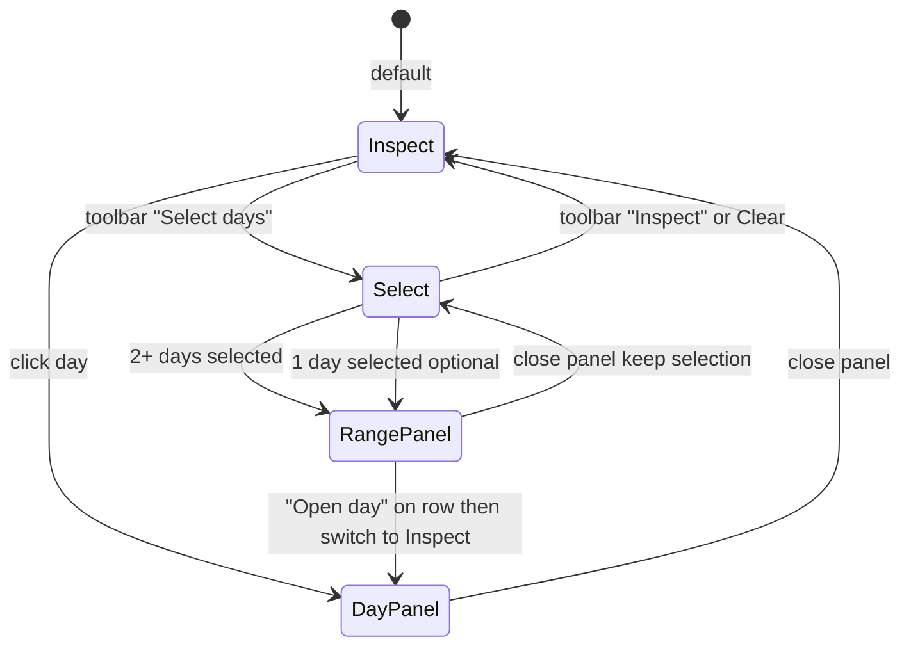

# Epic 3 — Calendar

Year and month calendar views driven by real engine output.

**Status (2026-07-03):** Year and month calendars are wired to live projection data via `useCalendarScreen` → `YearCalendarScreen` / `MonthCalendarScreen` (`/year`, `/month/$yearMonth`). Header metrics, indicators, day panel, and quick-add are implemented. Month view styling aligns with `docs/prototype/004/month.css` (weekend columns, entry label colors, below-buffer accent, balance line). Settlement actions and inline amount edit in the day panel are **not** implemented yet — mark-paid exists on Forecast only. Year view mobile layout is functional but not polished (small cells, horizontal scroll only). Data lives in an in-memory repo until persistent storage (ADR-006).

---

## US-3.1 — Year calendar grid

**Persona:** User

**Story:** As a user, I want a **linear year calendar** (months as rows, weekdays as columns) so I can scan cash-flow risk across the whole year.

**Priority:** P0  
**Depends on:** US-1.6, US-0.3

### Acceptance criteria

- [x] Layout matches [004-style-guide.md](../specs/004-style-guide.md) and `docs/prototype/004/` — `YearCalendarScreen` + `CalendarDayCell`
- [x] Weekend columns subtly shaded — via `CalendarDayCell` + column position in weekday band
- [x] Horizontal scroll through year; “jump to today” control — scroll container + auto-scroll to today on load
- [x] Each cell shows day number; data from `ProjectionResult.days` — `useCalendarScreen` + `indexProjectionDays`
- [ ] Month view entry from toolbar navigates to `/month/$yearMonth` (implemented); deep-link from year cell → month not yet available

---

## US-3.2 — Red dots and day indicators

**Persona:** User

**Story:** As a user, I want **red dots on risky days** and subtle indicators for income, large outflows, and card due dates so important days stand out.

**Priority:** P0  
**Depends on:** US-3.1, US-1.6

### Acceptance criteria

- [x] Red dot when `ProjectionDay.belowBuffer === true` — `Indicator` kind `danger`
- [x] Green indicator for days with net income (per style guide) — when `inflowsCents > 0`
- [x] Amber indicator when `largeOutflow === true`
- [x] Optional marker for statement due dates — `card` indicator when any item has `source === "statement_payment"`
- [x] Indicators driven by engine — `getDayIndicators()` in `packages/ui/src/lib/calendar.ts`

---

## US-3.3 — Calendar header metrics

**Persona:** User

**Story:** As a user, I want the **header to show working balance and next negative date** so I get the north-star answer without a separate dashboard.

**Priority:** P0  
**Depends on:** US-1.6, US-3.1

### Acceptance criteria

- [x] Displays `workingBalanceTodayCents` formatted per locale — `CalendarHeaderMetrics` + `MoneyAmount`
- [x] Displays `nextNegativeDate` or “no risk in horizon”
- [x] Alert badge when `nextNegativeDate` is set — `isAlertActive()`
- [x] Header visible on Year and Month calendar screens — `HeaderStrip` on both screens

---

## US-3.4 — Month calendar view

**Persona:** User

**Story:** As a user, I want a **month view** with denser detail so I can review and edit a single month’s cash flow.

**Priority:** P0  
**Depends on:** US-3.1

### Acceptance criteria

- [x] Same weekday column layout as year view, single month — 7-column grid with Sun–Sat header
- [x] Day cells show entry lines with actual vs projected colors per [003-screen-specs.md §2.6](../specs/003-screen-specs.md) — labels via `getDayEntryLines()`; balance line below date number
- [x] Toggle navigation between year and month views — Year view / Month view toolbar buttons; routes `/year` ↔ `/month/$yearMonth`
- [x] Same red-dot and indicator semantics as year view — shared `getDayIndicators()`
- [ ] Month totals summary strip matches prototype (Inflows / Outflows / Net / End balance) — app shows projected inflows, outflows, below-buffer day count instead

---

## US-3.5 — Day detail panel

**Persona:** User

**Story:** As a user, I want to **click a day** and see balance breakdown plus all items affecting that day so I understand why a day is red.

**Priority:** P0  
**Depends on:** US-3.1

### Acceptance criteria

- [x] Slide-over panel from year or month calendar — `DayDetailPanel` overlay; day preserved in URL search `?day=`
- [x] Shows opening/closing balance, inflows, outflows, item list from `ProjectionDay`
- [x] Distinguishes actual vs projected items — `Chip` variants + grouped sections (Transactions / Planned / Installments / Statement payments)
- [x] Quick-add entry points (income / expense / transfer) with day pre-filled — `QuickAddCard` in panel footer
- [ ] Inline amount edit on projected items (see US-3.8)
- [ ] Confirm payment / mark received on projected items (see US-3.9)

---

## US-3.6 — Quick-add from day panel

**Persona:** User

**Story:** As a user, I want to **add a transaction or planned item from the day panel** so I don’t leave the calendar context.

**Priority:** P1  
**Depends on:** US-3.5, US-4.1, US-5.1

### Acceptance criteria

- [x] Compact form per [003-screen-specs.md §2.3](../specs/003-screen-specs.md) — `QuickAddCard`
- [x] Successful save triggers projection recompute and panel refresh — `useCalendarQuickAdd` invalidates projection
- [x] Validation prevents invalid transfer to credit card (except statement flow) — `validateQuickAddTransfer`

---

## US-3.7 — Calendar keyboard and accessibility baseline

**Persona:** User (keyboard / assistive tech)

**Story:** As a user, I want **keyboard access to calendar days and the day panel** so I can navigate cash flow without a pointer.

**Priority:** P1  
**Depends on:** US-3.5

### Acceptance criteria

- [x] Day cells are focusable buttons with `aria-label` (ISO date on year view; month grid uses day number + implicit context)
- [x] Day panel exposes `role="dialog"`, `aria-modal`, labelled title, close control
- [ ] `Escape` closes day panel without leaving calendar route
- [ ] Focus trap while panel is open; focus returns to selected day on close
- [ ] Arrow-key navigation between day cells (optional P2 enhancement)

---

## US-3.8 — Inline amount edit in day panel

**Persona:** User

**Story:** As a user, I want to **tap an amount on a projected/transaction day item and edit it inline** so I can adjust a single occurrence without opening the full forecast editor.

**Priority:** P1  
**Depends on:** US-3.5, US-5.2

### Acceptance criteria

- [ ] Projected items (`isProjected === true`) and transaction items show amount with editable affordance (pencil hint on hover/focus) per `docs/prototype/004/css/day-panel.css`
- [ ] Click / Enter / Space opens inline currency input; Enter or blur saves; Escape cancels
- [ ] Invalid input shows inline error state (red border) and does not persist
- [ ] Save creates a **this-occurrence-only** `PlannedItemOverride` (amount) or updates `Installment.amountCentsOverride` / statement amount per source type — same semantics as [003-screen-specs.md §2.1](../specs/003-screen-specs.md)
- [ ] Actual (`isProjected === false`) ledger rows are editable also
- [ ] Successful save invalidates projection; panel and calendar cells refresh
- [ ] Storybook story covers idle, editing, invalid, and saved states

**Notes:** Prototype reference — `docs/prototype/004/js/day-panel.js` (`startAmountEdit` / `finishAmountEdit`). Reuse money parsing from transaction forms where possible.

---

## US-3.9 — Mark paid / received from day panel

**Persona:** User

**Story:** As a user, I want to **confirm payment or receipt of a projected item from the day panel** so the planned occurrence becomes today’s actual transaction without leaving the calendar.

**Priority:** P1  
**Depends on:** US-3.5, US-5.1, US-4.1

### Acceptance criteria

- [ ] Projected **planned** occurrences show a primary action (e.g. “Confirm payment” / “Confirm receipt”) per item type and sign
- [ ] Projected **installments** and **statement payments** show equivalent settle action (reuse labels from Forecast screen)
- [ ] Action calls existing settlement paths: `settlePlannedItem`, `settleInstallment`, or statement payment flow — same canonical links as [003-screen-specs.md §2.2](../specs/003-screen-specs.md)
- [ ] Settlement creates an actual `Transaction` dated **today** (`todayIso()`), with `settlesPlannedItemId` + `settlesPlannedOccurrenceDate` (or installment / statement fields); projected row disappears from that day after recompute
- [ ] Item moves to **Transactions** group in the panel (actual) and to the transactions ledger for today’s date
- [ ] Disabled or hidden for already-settled occurrences and for past-due items that need explicit amount confirmation first (define in UX review)
- [ ] Optimistic or loading state on the button; error surfaced inline
- [ ] E2E: open day with projected planned item → confirm → item appears under Transactions and calendar indicators update

**Notes:** `settlePlannedItem` / `settleInstallment` already exist in `packages/db`; Forecast screen exposes mark-paid via `usePlannedItemMutations` / `useInstallmentMutations` — wire the same mutations from `DayDetailPanel`.

---

## US-3.10 — Year calendar mobile layout

**Persona:** User (mobile)

**Story:** As a user on a phone, I want the **year calendar to be readable and tappable** so I can scan the full year without pinch-zooming or missing indicators.

**Priority:** P1  
**Depends on:** US-3.1, [US-11.2](./11-design-system.md#us-112--surfacecard-and-listitemcard-components) (optional)

### Acceptance criteria

- [ ] Audit current mobile pain points (cell size, scroll affordance, sticky headers, toolbar wrapping) against `docs/prototype/004/year.html`
- [ ] Minimum touch target for day cells meets `--touch-min` (44px) or documented exception with larger hit area
- [ ] Month labels and weekday band remain legible at 375px width; horizontal scroll hint visible (fade edge or scrollbar)
- [ ] Today marker and selected-day state visible on small screens
- [ ] Jump to today scrolls the current month row into view reliably on mobile
- [ ] Optional: compact mode toggles density vs readability (P2)
- [ ] Visual regression or Playwright screenshot at mobile viewport for `/year`

**Notes:** Year view uses `--day-cell-size: 28px` below 769px — likely too small for touch. Consider responsive token bump, vertical month stacking (P2), or defaulting mobile users to month view with prominent entry point.

---

## US-3.11 — Multi-day selection on year calendar

**Persona:** User

**Story:** As a user, I want to **select multiple days on the year calendar** and see **aggregated inflows, outflows, and all cash-flow entries** for those days so I can review a pay period, trip, or any custom date range without leaving the hub view.

**Priority:** P2  
**Depends on:** US-3.1, US-3.5  
**Status:** Backlog — **design and UX pending** (see options below)

### Problem

Today `/year` supports **one selected day** at a time (`?day=YYYY-MM-DD`), which opens `DayDetailPanel` with that day’s balance breakdown, item list, and quick-add. There is no way to answer: *“What moves in and out across these five days?”*

### UX open questions

| Question | Notes |
|---|---|
| Same screen or new screen? | Year hub is scan-first; range review feels like an extension, not a new primary destination — but year cells are small and multi-select is awkward on mobile ([US-3.10](./03-calendar.md#us-310--year-calendar-mobile-layout)). |
| How does it coexist with single-day inspect? | `DayDetailPanel` is optimized for **one day**: open/close balance, per-item actions (US-3.8, US-3.9), quick-add. Range view is **read-heavy aggregation** — mixing both in one panel risks clutter and conflicting actions. |
| What selection gestures? | Click-toggle, Shift+click range, drag-to-select across cells, or explicit “select mode” toggle — TBD in design pass. |
| Month view too? | Out of scope for first cut unless design reuses the same range panel from `/month/$yearMonth`. |

### Design options (pick one in design review)

#### Option A — Selection mode on `/year` **(recommended default)**

Add an explicit toolbar control: **Inspect** (default, current behaviour) ↔ **Select**.

| Mode | Grid behaviour | Panel |
|---|---|---|
| **Inspect** | Click day → `DayDetailPanel` (`?day=`) | Unchanged ([US-3.5](./03-calendar.md#us-35--day-detail-panel)) |
| **Select** | Click toggles day in set; Shift+click adds inclusive range; selected cells show a **selection ring** (distinct from single-day “inspect” highlight) | **Range summary panel** — new component, not `DayDetailPanel` |

When **2+ days** are selected, show the range panel with totals + merged entry list. **Do not** open `DayDetailPanel` until the user switches back to Inspect or chooses “Open day” on a specific row.

When **1 day** is selected in Select mode, the range panel still works (totals = that day’s inflows/outflows; item list = that day’s items) — or design may auto-fallback to Inspect; document the choice in prototype.

**Pros:** No new nav item; keeps `/year` as hub; clear separation between “edit one day” and “summarize many days”.  
**Cons:** Mode toggle adds chrome; mobile needs a discoverable select mode ([US-3.10](./03-calendar.md#us-310--year-calendar-mobile-layout)).

#### Option B — Extend `DayDetailPanel` for multi-day

Single panel adapts: 1 day = current layout; 2+ days = range header + aggregated totals + items grouped by date. Quick-add and settle actions disabled until exactly one day is focused.

**Pros:** One panel pattern.  
**Cons:** Panel becomes two products; URL/state awkward (`?day=` vs `?days=`); edit actions harder to reason about.

#### Option C — New screen (e.g. `/calendar/range` or report tab)

Dedicated range-analysis view with date pickers and optional category breakdown.

**Pros:** Room for richer reporting later.  
**Cons:** Extra nav surface for a secondary workflow; duplicates data already on year view. Defer unless range analysis becomes a primary persona need.

### Recommended direction

**Option A** — dual mode on `/year` with a dedicated **Range summary panel** (`RangeDetailPanel` or similar in `@cashflow/ui`). Reuse slide-over / backdrop patterns from `DayDetailPanel` and `StatementListPanel`, but **do not** overload `DayDetailPanel`.

### Data and aggregation (no engine change)

All data comes from existing `ProjectionResult.days[]` (`ProjectionDay` per [001-data-model.md §6](../specs/001-data-model.md)):

| Metric | Rule |
|---|---|
| **Total inflows** | Sum of `inflowsCents` over selected days |
| **Total outflows** | Sum of `outflowsCents` over selected days |
| **Net** | Total inflows − total outflows (or show both; match month summary strip semantics when defined) |
| **Opening balance** | `openingBalanceCents` of the **earliest** selected day (by date) |
| **Closing balance** | `closingBalanceCents` of the **latest** selected day |
| **Entries** | Concatenate `items[]` from each selected day; group by date (subsection per day) or flat chronological list — **TBD in design** |
| **Empty selection** | Range panel closed; grid shows no selection ring |

Non-contiguous days (e.g. Mon + Wed + Fri) are in scope — sum and list include only those dates, not the gaps between them.

### URL and state (suggested)

- Inspect mode: `?day=2026-07-15` (unchanged)
- Select mode: `?select=2026-07-01,2026-07-05,2026-07-07` **or** `?from=2026-07-01&to=2026-07-07` for contiguous ranges — pick one encoding in implementation; document in [003-screen-specs.md §3](../specs/003-screen-specs.md) when design locks
- Modes should not fight: entering Inspect with `?day=` clears multi-select (or design documents “preserve selection in sessionStorage” — default: clear)

### Acceptance criteria

**Design gate (required before build)**

- [ ] Design review picks Option A, B, or C and records it in [003-screen-specs.md §3](../specs/003-screen-specs.md)
- [ ] Prototype or Storybook story for: Select mode on grid, 1 day selected, 3+ days selected, empty clear, mobile affordance
- [ ] Documented interaction with existing `?day=` / `DayDetailPanel` (Inspect vs Select)

**Functional (after design lock)**

- [ ] User can select **multiple non-contiguous days** on `/year` (exact gesture per design)
- [ ] Selected days are visually distinct from red-dot / indicator semantics and from single-day inspect highlight
- [ ] Range summary shows **total inflows**, **total outflows**, and **net** for the selection
- [ ] Range summary lists **all projection items** across selected days (actual + projected), with date visible per row or grouped by day
- [ ] **Clear selection** control resets grid and closes range panel
- [ ] Totals match manual sum of `ProjectionDay.inflowsCents` / `outflowsCents` for the same dates (unit test on aggregation helper)
- [ ] Selecting days does not trigger projection recompute (read-only aggregation)
- [ ] Keyboard: Escape clears selection or closes range panel per design; focus management documented

**Out of scope (v1 of this story)**

- Settle, inline edit, or quick-add across multiple days at once
- Category/subcategory breakdown for the range (future enhancement)
- Multi-day select on month view (follow-up story if Option A ships)
- Export range to CSV

### Notes

- Aggregation logic belongs in `packages/ui/src/lib/calendar.ts` (or `packages/core` if reused by month view later) — pure function over `ProjectionDay[]` + `Set<string>` of ISO dates.
- Playwright: select three days with known fixture totals → assert range panel sums.
- If mobile select proves unusable on year grid, design may limit Select mode to desktop (`min-width: 769px`) and defer mobile to month view — document any breakpoint gate.

---
