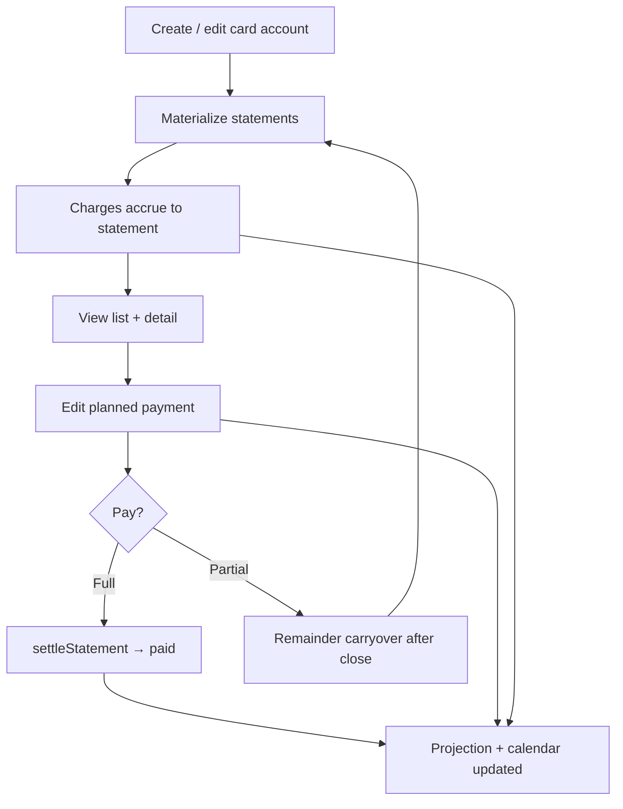

# Epic 6 — Credit cards (UI & statements)

User-facing credit card flows beyond engine logic.

**Status (2026-07-17):** Statement materialization, charge accrual, opening-debt seeding, payment settlement, and **partial-payment carryover after `closingDate`** (US-6.5 option A/D) are implemented in `packages/db`. UI covers statement listing on **Accounts**, statement management on **Forecast**, charge breakdown with **edit/delete** on items, Save override without paying (US-6.2), and deep-link from paid/partial rows to the payment transaction on `/transactions`. Data lives in an in-memory repo; it resets on reload until persistent storage lands (ADR-006).

---

## US-6.1 — View statement list and totals

**Persona:** User

**Story:** As a user, I want to **see upcoming statements** per card with computed totals so I know what’s due and when.

**Priority:** P0  
**Depends on:** US-2.4, US-1.4

### Acceptance criteria

- [x] List statements in horizon with closing date, due date, computed total — `StatementListPanel` on `/accounts` (per-card 📄 action) and expandable schedule on `/forecast` (`CreditCardStatementRow`); rows materialized on card create/update within `Settings.horizonMonths`
- [x] Show `plannedPaymentCents` override when set — “Override” chip and separate Pay column in both panels
- [x] Paid statements linked to payment transaction — “View” opens `/transactions?edit=<paymentTransactionId>`
- [x] Unpaid remainder from a prior statement visible on the next statement total — carryover after `closingDate` (US-6.5)

---

## US-6.2 — Override statement payment amount

**Persona:** User

**Story:** As a user, I want to **edit the projected payment** for a statement so partial payments are reflected in the forecast.

**Priority:** P0  
**Depends on:** US-6.1

### Acceptance criteria

- [x] Edit `plannedPaymentCents` per statement occurrence — `StatementEditorPanel` on `/forecast` and `/accounts` with **Save changes** (persists without recording payment)
- [x] Engine uses override instead of full `computedTotalCents` for working outflow on due date — `plannedPaymentCents ?? computedTotalCents` in `statementDayEvents` and `settleStatement`
- [x] Reset to auto-computed full balance — “Reset to full” in `StatementEditorPanel` calls `resetOverride`
- [x] Partial override reduces **only** the due-date outflow; unpaid remainder is added to the next statement’s `computedTotalCents` after closing (US-6.5)

---

## US-6.3 — Pay statement from ledger

**Persona:** User

**Story:** As a user, I want to **record a statement payment** as a transfer that settles the statement so actual matches projection.

**Priority:** P0  
**Depends on:** US-6.1, US-4.1

### Acceptance criteria

- [x] Payment creates transfer from working account with `paysStatementId` — `settleStatement()` in `packages/db/src/settlements/statement.ts`
- [x] Sets `CreditCardStatement.paymentTransactionId` — `creditCardStatementsRepo.markPaid` / `markPartiallyPaid`
- [x] Suppresses projected payment for that due date — engine settlement index skips paid and partially paid statements (`US-1.4`); deleting the payment transaction reverts the statement (`transactionsRepo.delete` + `markUnpaid`)
- [x] UI entry points on `/forecast` and `/accounts` — **Mark paid** / **Record payment** (`useStatementMutations`)
- [x] Partial payment leaves statement `partially_paid` and carries remainder — `paidAmountCents` + next-statement carryover (US-6.5)
- [x] Payment transfer appears on `/transactions` with statement settlement chip; Accounts “View” deep-links to the editor

---

## US-6.4 — Onboard card with existing debt

**Persona:** User

**Story:** As a user, I want **existing fatura balance** to appear on the next due date when I add a card so I don’t start from zero.

**Priority:** P0  
**Depends on:** US-2.3, US-1.4

### Acceptance criteria

- [x] Card anchor with positive owed balance seeds first due statement — `materializeStatementsForCard` includes opening debt on the first statement with `dueDate >= anchorDate`; triggered from `accountsRepo.create` / `update`
- [x] Calendar shows working outflow on that due date in projection — `credit-card-cycle` fixture + `project.test.ts`; calendar `card` indicator on statement due dates (US-3.2)
- [x] Covered by `credit-card-cycle` fixture and engine tests — also `packages/db/src/materialize/statements.test.ts` and `statementCharges.test.ts` (opening-debt charge row in `StatementDetailPanel`)

---

## US-6.5 — Partial payment carryover to next statement

**Persona:** User

**Story:** As a user, I want **unpaid statement balance to roll into the next fatura** so partial payments and planned shortfalls match real card behavior and future due dates stay accurate.

**Priority:** P0  
**Depends on:** US-6.2, US-6.3, US-1.4

### Design decision

**Option D (implemented):** automatic carryover when `closingDate` passes; carryover appears as an explicit charge line (`source: carryover`) on the next statement; user can change planned payment / settle partial amounts; actual partial payments set `status = partially_paid` + `paidAmountCents` and do not mark fully paid.

### Acceptance criteria

- [x] **Decision recorded** in data model (§3.7): carryover triggers after `closingDate`
- [x] Next statement `computedTotalCents` includes prior unpaid remainder (explicit carryover component)
- [x] Partial **projection** (`plannedPaymentCents < computedTotalCents`) rolls remainder forward after close
- [x] Partial **actual** payment records `paidAmountCents`, status `partially_paid` when remainder &gt; 0, and rolls remainder forward
- [x] Full payment clears carryover for that cycle; no double-count with period charges
- [x] UI shows carryover line in statement detail and “Partial” status on list/schedule when applicable
- [x] Engine projects correct working outflows: partial due-date payment + increased next-statement due-date payment
- [x] Tests: fatura R$ 1.500, pay/plan R$ 1.000 → next statement includes R$ 500 carryover (`statements.test.ts`, `statement.test.ts`, `statementCharges.test.ts`)
- [x] Statement items support **edit** and **delete** (transaction → ledger; planned → skip occurrence; installment → zero amount)

---

## US-6.6 — Review credit card flows end-to-end

**Persona:** Developer / QA

**Story:** As a team, we want a **single checklist covering every credit card path** so regressions are caught before release, especially after US-6.5 carryover lands.

**Priority:** P0  
**Depends on:** US-6.1 – US-6.5, US-2.4, US-4.1, US-1.4

### Flow map

### Review checklist

#### Account setup (US-2.3, US-2.4, US-6.4)

- [ ] Create credit card with `closingDay`, `dueDay`, `defaultPayFromAccountId`
- [ ] Create card with `anchorBalanceCents > 0` → first due statement includes opening debt
- [ ] Edit cycle config → statements rematerialized; paid statements preserved
- [ ] Re-anchor card with new owed balance → opening debt updates on correct statement
- [ ] Archive card → statements no longer drive projection

#### Charge accrual (US-1.4, US-5.x, US-7.x)

- [ ] Expense transaction on card → assigned to statement by purchase `effectiveDate` vs closing window
- [ ] Planned item (subscription) on card → accrues to correct statement, not working cash on purchase date
- [ ] Installment plan on card → installment accrues to statement containing due date
- [ ] `StatementDetailPanel` lists all charge sources with projected/actual badges
- [ ] Edit / delete charge from statement detail (transaction, planned occurrence, installment)

#### Statement list & totals (US-6.1)

- [ ] `/accounts` → 📄 opens `StatementListPanel` with period, close, due, total, pay, status
- [ ] `/forecast` → Statements filter and expandable `CreditCardStatementRow`
- [ ] Override chip when `plannedPaymentCents` set
- [ ] Paid / partial row links to payment transaction (deep-link)

#### Planned payment edit (US-6.2)

- [ ] Edit planned amount and pay-from on Forecast and Accounts
- [ ] **Save** persists override without forcing payment
- [ ] Reset to full clears override
- [ ] Partial planned payment shows reduced calendar outflow on due date

#### Payment settlement (US-6.3)

- [ ] **Mark paid** creates transfer with `paysStatementId`, sets `paymentTransactionId`
- [ ] **Record payment** from editor applies override then settles
- [ ] Paid statement suppressed in projection; working balance drops on payment date
- [ ] Delete payment transaction → statement reverts to unpaid/closed
- [ ] Transfer to card blocked in transaction editor unless `paysStatementId` set
- [ ] Payment appears in `/transactions`

#### Partial payment & carryover (US-6.5)

- [ ] Planned partial → remainder on next statement after closingDate
- [ ] Actual partial payment → `partially_paid`; remainder on next statement
- [ ] Full payment after partial plan clears debt correctly
- [ ] No double-count: carryover + period charges = expected fatura total

#### Projection & calendar (US-1.4, US-3.2)

- [ ] Card purchase date does **not** reduce working balance
- [ ] Statement due date reduces working balance by pay amount (full or override)
- [ ] Calendar `card` indicator on statement due dates
- [ ] `credit-card-cycle` fixture: purchase 27/06, close 26/07, pay 01/08

#### Cross-screen consistency

- [ ] Accounts statement list totals match Forecast statement rows for same card
- [ ] Statement detail totals match list row
- [ ] Mutations invalidate projection, forecast, statements, and calendar queries

### Test assets

- [x] Engine fixture `credit-card-cycle.json` passes
- [x] DB tests: `statements.test.ts`, `statementCharges.test.ts`, `statement.test.ts` (settlement + carryover)
- [x] Partial payment + carryover covered in DB tests
- [ ] Manual walkthrough on seed data (`household-june-2026` or local card setup)
- [x] Time travel dev panel ([US-12.2](./12-developer-tools.md#us-122--time-travel-panel-ui)) for stepping through due dates without changing OS clock — see [US-12.5](./12-developer-tools.md#us-125--time-travel-flow-test-scenarios) scenario scripts
