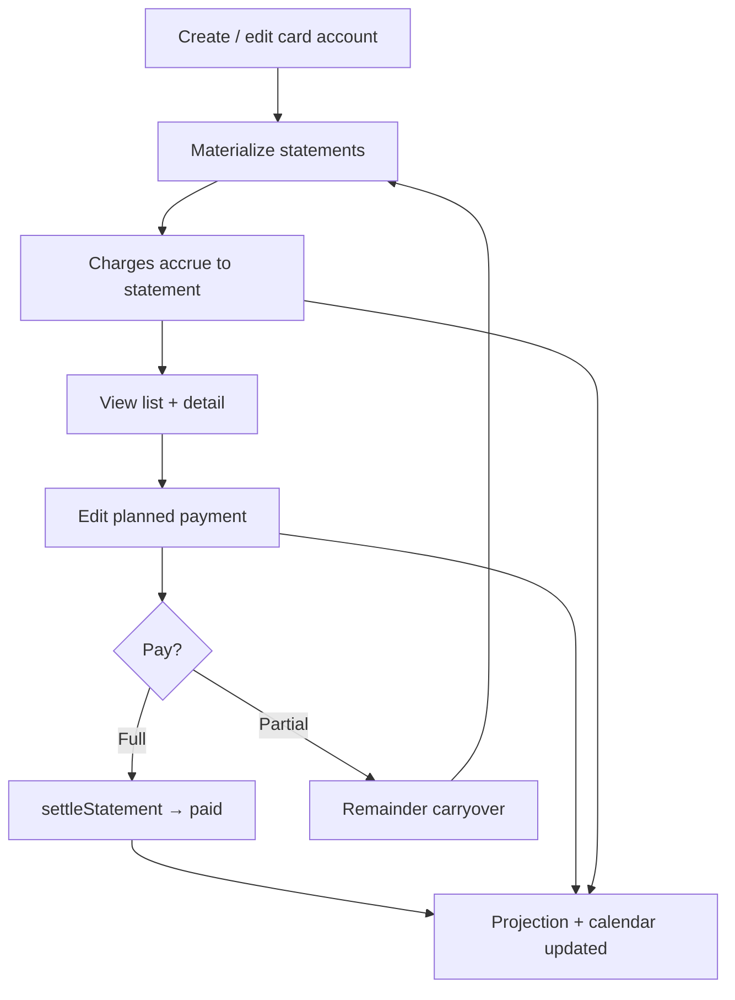

# Epic 6 — Credit cards (UI & statements)

User-facing credit card flows beyond engine logic.

**Status (2026-07-05):** Statement materialization, charge accrual, opening-debt seeding, and payment settlement are implemented in `packages/db` (`materialize/statements.ts`, `settlements/statement.ts`). The UI covers statement listing on **Accounts** (`StatementListPanel`), statement management on **Forecast** (`CreditCardStatementRow`, `StatementEditorPanel`), and charge breakdown (`StatementDetailPanel`). Engine projection and calendar indicators for statement due dates work via `statementDayEvents` (US-1.4). Data lives in an in-memory repo; it resets on reload until persistent storage lands (ADR-006).

**Known gaps:** partial payment does not carry unpaid balance to the next statement (US-6.5); `settleStatement` marks a statement **paid** even when payment &lt; `computedTotalCents`; save override without recording payment (US-6.2); statement edit from Accounts; deep-link to payment transaction (US-6.1). See **US-6.6** for the full flow review checklist.

---

## US-6.1 — View statement list and totals

**Persona:** User

**Story:** As a user, I want to **see upcoming statements** per card with computed totals so I know what’s due and when.

**Priority:** P0  
**Depends on:** US-2.4, US-1.4

### Acceptance criteria

- [x] List statements in horizon with closing date, due date, computed total — `StatementListPanel` on `/accounts` (per-card 📄 action) and expandable schedule on `/forecast` (`CreditCardStatementRow`); rows materialized on card create/update within `Settings.horizonMonths`
- [x] Show `plannedPaymentCents` override when set — “Override” chip and separate Pay column in both panels
- [ ] Paid statements linked to payment transaction — paid status and “View” link render in `StatementListPanel`, but navigation goes to `/transactions` without opening or highlighting the linked `paymentTransactionId`
- [ ] Unpaid remainder from a prior statement visible on the next statement total — **not implemented**; `computedTotalCents` sums only charges in the current period (see US-6.5)

---

## US-6.2 — Override statement payment amount

**Persona:** User

**Story:** As a user, I want to **edit the projected payment** for a statement so partial payments are reflected in the forecast.

**Priority:** P0  
**Depends on:** US-6.1

### Acceptance criteria

- [ ] Edit `plannedPaymentCents` per statement occurrence — `StatementEditorPanel` on `/forecast` (Edit / Items → Edit) accepts amount and pay-from account; `statementMutations.update` exists but is not wired to a Save action, so overrides persist only when **Record payment** runs (or if already stored)
- [x] Engine uses override instead of full `computedTotalCents` for working outflow on due date — `plannedPaymentCents ?? computedTotalCents` in `statementDayEvents` and `settleStatement`
- [x] Reset to auto-computed full balance — “Reset to full” in `StatementEditorPanel` calls `resetOverride`
- [ ] Partial override reduces **only** the due-date outflow; unpaid remainder is **not** added to the next statement’s `computedTotalCents` — depends on US-6.5

---

## US-6.3 — Pay statement from ledger

**Persona:** User

**Story:** As a user, I want to **record a statement payment** as a transfer that settles the statement so actual matches projection.

**Priority:** P0  
**Depends on:** US-6.1, US-4.1

### Acceptance criteria

- [x] Payment creates transfer from working account with `paysStatementId` — `settleStatement()` in `packages/db/src/settlements/statement.ts`
- [x] Sets `CreditCardStatement.paymentTransactionId` — `creditCardStatementsRepo.markPaid`
- [x] Suppresses projected payment for that due date — engine settlement index skips paid statements (`US-1.4`); deleting the payment transaction reverts the statement (`transactionsRepo.delete` + `markUnpaid`)
- [x] UI entry points on `/forecast` — **Mark paid** on statement row and **Record payment** in editor (`useStatementMutations.markPaid` / `recordPayment`)
- [ ] Partial payment leaves statement in a **partially settled** state and carries remainder — **not implemented**; `settleStatement` always calls `markPaid` regardless of amount paid vs `computedTotalCents` (see US-6.5)

---

## US-6.4 — Onboard card with existing debt

**Persona:** User

**Story:** As a user, I want **existing fatura balance** to appear on the next due date when I add a card so I don’t start from zero.

**Priority:** P0  
**Depends on:** US-2.3, US-1.4

### Acceptance criteria

- [x] Card anchor with positive owed balance seeds first due statement — `materializeStatementsForCard` includes opening debt on the first statement with `dueDate >= anchorDate`; triggered from `accountsRepo.create` / `update`
- [x] Calendar shows working outflow on that due date in projection — `credit-card-cycle` fixture + `project.test.ts`; calendar `card` indicator on statement due dates (US-3.2)
- [x] Covered by `credit-card-cycle` fixture and engine tests — also `packages/db/src/materialize/statements.test.ts` and `statementCharges.test.ts` (opening-debt charge row in `StatementDetailPanel`)

---

## US-6.5 — Partial payment carryover to next statement

**Persona:** User

**Story:** As a user, I want **unpaid statement balance to roll into the next fatura** so partial payments and planned shortfalls match real card behavior and future due dates stay accurate.

**Priority:** P0  
**Depends on:** US-6.2, US-6.3, US-1.4

### Problem (current behavior)

Today, `computedTotalCents` = charges in `(periodStart..closingDate]` only (plus opening debt on the anchor statement). Setting `plannedPaymentCents` below the total lowers the **projected working outflow** on due date but does **not** increase the next statement. Recording a partial payment via `settleStatement` still marks the statement **paid** and drops the remainder entirely.

### Design decision — when does carryover happen?

Resolve **one** primary rule before implementation (user-editable overrides apply on top):

| Option | Trigger | Pros | Cons |
|---|---|---|---|
| **A — On closing date (recommended default)** | When `closingDate` passes, unpaid balance from the prior cycle (`computedTotalCents − amountPaidCents`, or `computedTotalCents − plannedPaymentCents` for future projection) is added to the next statement as a **carryover** line | Matches Brazilian fatura rollover; automatic; projection stays accurate after close | Needs clear UX for “closed but not yet due” vs “due date passed” |
| **B — On due date** | Carryover posts when `dueDate` passes without full payment | Aligns with cash impact | Understates next fatura between close and due; harder to reconcile with bank app |
| **C — User action only** | Carryover created only when user records partial payment or manually adds remainder | Full control | Easy to drift from reality; extra steps every month |
| **D — Hybrid (recommended stretch)** | **Automatic on closing date** for projection; **user can edit** carryover on the next statement (override or clear); partial **actual** payment on settle always creates explicit remainder | Best of A + C | More fields and UI |

**Recommendation:** **D** — automatic carryover at `closingDate` for forecast accuracy, with optional user edit on the receiving statement. Actual partial payments (`settleStatement` with `amountCents < computedTotalCents`) must create remainder immediately and must **not** mark the statement fully paid.

### Data model notes (to align with [001-data-model.md §3.7](../specs/001-data-model.md))

- Consider `StatementStatus`: add `partially_paid` or track `paidAmountCents` + derive remainder.
- Carryover should appear in `StatementDetailPanel` as a charge row (`source: carryover` or `opening_debt`-like) so totals are auditable.
- `plannedPaymentCents` = forecast intent; actual remainder after settlement may differ — both paths feed carryover.

### Acceptance criteria

- [ ] **Decision recorded** in data model / ADR: trigger(s) for carryover (pick from table above)
- [ ] Next statement `computedTotalCents` includes prior unpaid remainder (as explicit carryover component, not silent)
- [ ] Partial **projection** (`plannedPaymentCents < computedTotalCents`) rolls remainder forward per chosen trigger
- [ ] Partial **actual** payment records `paidAmountCents`, does not mark statement fully paid when remainder &gt; 0, and rolls remainder forward
- [ ] Full payment clears carryover for that cycle; no double-count with period charges
- [ ] UI shows carryover line in statement detail and “Partial” / remainder hint on statement list when applicable
- [ ] Engine projects correct working outflows: partial due-date payment + increased next-statement due-date payment
- [ ] Fixture + tests: e.g. fatura R$ 1.500, pay R$ 1.000 on due date → next statement includes R$ 500 carryover + new charges

---

## US-6.6 — Review credit card flows end-to-end

**Persona:** Developer / QA

**Story:** As a team, we want a **single checklist covering every credit card path** so regressions are caught before release, especially after US-6.5 carryover lands.

**Priority:** P0  
**Depends on:** US-6.1 – US-6.5, US-2.4, US-4.1, US-1.4

### Flow map

### Review checklist

#### Account setup (US-2.3, US-2.4, US-6.4)

- [ ] Create credit card with `closingDay`, `dueDay`, `defaultPayFromAccountId`
- [ ] Create card with `anchorBalanceCents > 0` → first due statement includes opening debt
- [ ] Edit cycle config → statements rematerialized; paid statements preserved
- [ ] Re-anchor card with new owed balance → opening debt updates on correct statement
- [ ] Archive card → statements no longer drive projection

#### Charge accrual (US-1.4, US-5.x, US-7.x)

- [ ] Expense transaction on card → assigned to statement by purchase `effectiveDate` vs closing window
- [ ] Planned item (subscription) on card → accrues to correct statement, not working cash on purchase date
- [ ] Installment plan on card → installment accrues to statement containing due date
- [ ] `StatementDetailPanel` lists all charge sources with projected/actual badges

#### Statement list & totals (US-6.1)

- [ ] `/accounts` → 📄 opens `StatementListPanel` with period, close, due, total, pay, status
- [ ] `/forecast` → Statements filter and expandable `CreditCardStatementRow`
- [ ] Override chip when `plannedPaymentCents` set
- [ ] Paid row links to payment transaction (deep-link — currently broken)

#### Planned payment edit (US-6.2)

- [ ] Edit planned amount and pay-from on Forecast
- [ ] **Save** persists override without forcing payment (currently broken)
- [ ] Reset to full clears override
- [ ] Partial planned payment shows reduced calendar outflow on due date

#### Payment settlement (US-6.3)

- [ ] **Mark paid** creates transfer with `paysStatementId`, sets `paymentTransactionId`
- [ ] **Record payment** from editor applies override then settles
- [ ] Paid statement suppressed in projection; working balance drops on payment date
- [ ] Delete payment transaction → statement reverts to unpaid/closed
- [ ] Transfer to card blocked in transaction editor unless `paysStatementId` set

#### Partial payment & carryover (US-6.5)

- [ ] Planned partial → remainder on next statement (per chosen trigger)
- [ ] Actual partial payment → statement not fully paid; remainder on next statement
- [ ] Full payment after partial plan clears debt correctly
- [ ] No double-count: carryover + period charges = expected fatura total

#### Projection & calendar (US-1.4, US-3.2)

- [ ] Card purchase date does **not** reduce working balance
- [ ] Statement due date reduces working balance by pay amount (full or override)
- [ ] Calendar `card` indicator on statement due dates
- [ ] `credit-card-cycle` fixture: purchase 27/06, close 26/07, pay 01/08

#### Cross-screen consistency

- [ ] Accounts statement list totals match Forecast statement rows for same card
- [ ] Statement detail totals match list row
- [ ] Mutations invalidate projection, forecast, statements, and calendar queries

### Test assets

- [ ] Engine fixture `credit-card-cycle.json` passes
- [ ] DB tests: `statements.test.ts`, `statementCharges.test.ts`, `statement.test.ts` (settlement)
- [ ] New fixture for partial payment + carryover (add when US-6.5 implemented)
- [ ] Manual walkthrough on seed data (`household-june-2026` or local card setup)
- [ ] Time travel dev panel ([US-12.2](./12-developer-tools.md#us-122--time-travel-panel-ui)) for stepping through due dates without changing OS clock — see [US-12.5](./12-developer-tools.md#us-125--time-travel-flow-test-scenarios) scenario scripts
