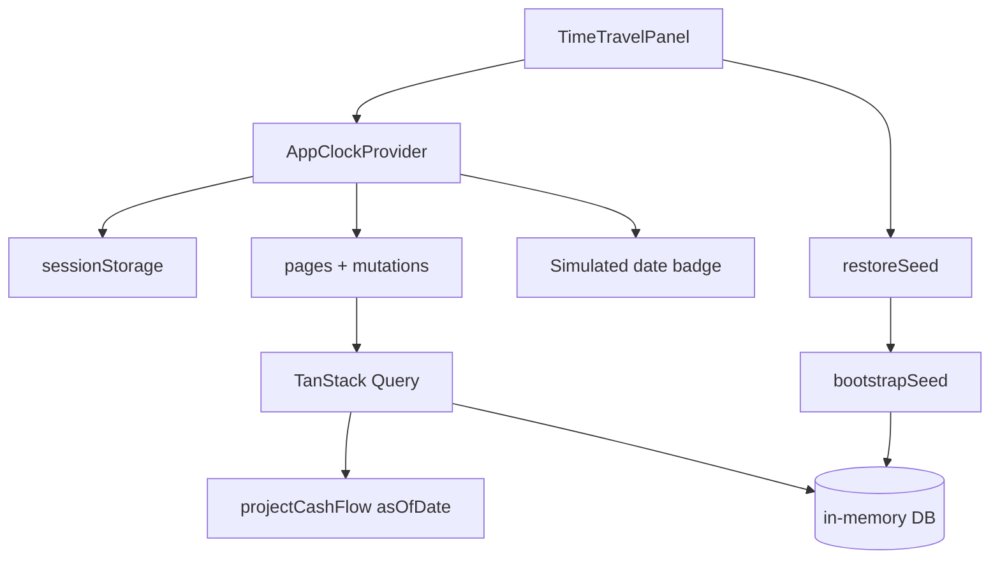

# Epic 12 — Developer tools (time travel)

Dev-only utilities for manual QA and flow testing without waiting for real calendar dates.

**Status (2026-07-07):** Implemented. Forward-only fast-forward from seed anchor `2026-06-28`, **Restore seed** (no Reset, no presets). `AppClockProvider` + dev panel wired across queries, mutations, and statement materialization. Manual QA scenarios in [US-12.5](#us-125--time-travel-flow-test-scenarios).

**Motivation:** Credit card flows (US-6.6), calendar projection, installment payoffs, and category budgets all depend on “today”. A **fast-forward** dev panel lets developers walk forward from the seed anchor date through end-to-end behavior in the running app.

### Forward-only model

Time travel is **fast-forward from seed**, not a bidirectional time machine. In dev builds, “today” **always starts at the seed anchor** (`2026-06-28`); there is no jump to the real wall-clock date and no preset shortcuts.

| Action | Rule |
|---|---|
| **App load (dev)** | Effective today = seed anchor `2026-06-28` (or last forward position in sessionStorage) |
| **+1 day / +7 days / date picker / Apply** | Only dates **≥ current effective today** |
| **Restore seed** | Reload in-memory DB to bootstrap seed **and** reset effective today to `2026-06-28` |

Going back in simulated time is **not supported**. To revisit the seed anchor or discard QA mutations, use **Restore seed**.

---

## US-12.1 — Injectable application clock

**Persona:** Developer

**Story:** As a developer, I want a **single source of truth for “today”** so every layer uses the same simulated date when time travel is active.

**Priority:** P1  
**Depends on:** US-0.2

### Problem

`todayIso()` is called directly from:

- **App queries:** `useAccounts`, `useProjection`, `useCalendarScreen`, `useForecastScreen`, `useStatementDetail`
- **Mutations:** mark paid / settle flows (`usePlannedItemMutations`, `useInstallmentMutations`, `useStatementMutations`, `useCalendarQuickAdd`)
- **DB layer:** `materializeStatementsForCard`, `recomputeStatementTotalsForCard`, `creditCardStatementsRepo.markUnpaid`, `listStatementCharges`

When the simulated date changes, all of these must agree.

### Design

Introduce a **clock provider** in `packages/app` (not persisted user Settings). Share the seed anchor with bootstrap code:

```ts
/** Matches seed materialization in main.tsx / bootstrapSeed(). */
export const SEED_ANCHOR_DATE = "2026-06-28";

type AppClock = {
  /** Effective today for the whole app. Seed anchor in dev; real date in production. */
  today: string; // ISO YYYY-MM-DD
  /** Set simulated today. Forward-only: rejects iso < today. */
  setToday: (iso: string) => void;
  /** Reset DB to seed and today to SEED_ANCHOR_DATE. */
  restoreSeed: () => void;
};
```

- **Dev builds:** `today` defaults to `SEED_ANCHOR_DATE`, not real `todayIso()`.
- **Production builds:** no dev clock — app keeps using real `todayIso()`; panel not mounted.
- Forward steps persisted in **sessionStorage** (survives reload during a QA session; missing/invalid key falls back to `SEED_ANCHOR_DATE`).
- `@cashflow/core` keeps `todayIso()` as the real-clock helper for tests and server-less engine runs; the app reads `useAppClock().today` in dev instead of calling `todayIso()` at runtime.
- **Forward-only:** `setToday(iso)` rejects `iso < today` (no-op or inline error).

Extract `bootstrapSeed(asOfDate = SEED_ANCHOR_DATE)` from `main.tsx` (seed entities + `materializeAllCreditCardStatements` + Jul 3 paid-statement link). Used on first load and by `restoreSeed()`.

### Acceptance criteria

- [ ] `AppClockProvider` wraps the app in `main.tsx` (inside `QueryClientProvider`); dev-only or no-op in production
- [ ] `useAppClock()` hook returns `today`, `setToday`, `restoreSeed`
- [ ] Dev default `today` is `SEED_ANCHOR_DATE`
- [ ] Forward position persisted in `sessionStorage` under a dev-only key (e.g. `cashflow:devClock`)
- [ ] Invalid JSON / missing key falls back to `SEED_ANCHOR_DATE`
- [ ] `setToday` enforces forward-only (no-op or inline error)
- [ ] `restoreSeed` calls `bootstrapSeed()` and sets `today` to `SEED_ANCHOR_DATE`
- [ ] Unit test: provider returns sessionStorage forward position when set
- [ ] Unit test: forward-only guard rejects backward date
- [ ] Unit test: `restoreSeed` resets today to `SEED_ANCHOR_DATE`

---

## US-12.2 — Time travel panel UI

**Persona:** Developer

**Story:** As a developer, I want an **overlapping panel** where I can **fast-forward** from the seed anchor so I can test dated flows without changing my OS clock or rewinding the ledger.

**Priority:** P1  
**Depends on:** US-12.1  
**Soft reference:** [US-11.1](./11-design-system.md#us-111--app-design-audit-and-pattern-inventory) (panel layout) — follow `StatementListPanel` / `EditorPanel` patterns; no need to wait on the audit.

### UI spec

Floating **dev tools** affordance — not part of the user-facing Settings screen.

| Element | Behavior |
|---|---|
| **Trigger** | Fixed pill or icon button (e.g. bottom-right), visible only in dev builds |
| **Panel** | Overlapping slide-over or popover (`role="dialog"`), same pattern as `StatementListPanel` / `EditorPanel` |
| **Date picker** | ISO date input; default = current effective today; `min` = effective today |
| **Apply** | Sets simulated today via `setToday` (forward-only) |
| **+1 day / +7 days** | Step forward only |
| **Restore seed** | `restoreSeed()` — reload bootstrap seed and reset today to `2026-06-28` (**P1**; required to rerun US-12.5 scenarios; confirm if mutations exist) |
| **Badge** | Persistent in dev: “Simulated: 2026-08-01” (always shows effective today) |

No **−1 day**, **Reset** (to real calendar), or **preset** buttons.

Mount in `AppShell` (badge + trigger). Presentational panel in `packages/ui`; wiring in `packages/app`.

### Acceptance criteria

- [ ] Panel opens from dev trigger; does not appear in production builds (`import.meta.env.PROD` guard unless `VITE_ENABLE_TIME_TRAVEL=true`)
- [ ] Date picker sets simulated today on Apply; rejects dates before effective today
- [ ] +1 / +7 step buttons advance from current effective today only
- [ ] Restore seed resets ledger and today to `SEED_ANCHOR_DATE` (confirm if mutations exist)
- [ ] Simulated-date badge visible app-wide in dev builds
- [ ] Storybook story for panel in isolated state (mock clock provider)
- [ ] Panel z-index above main content but below modal editors if both open (document stacking rule)

---

## US-12.3 — Wire app-wide refresh to simulated date

**Persona:** Developer

**Story:** As a developer, I want **every screen and mutation to respect the simulated date** so time travel actually changes what I see and what I settle.

**Priority:** P1  
**Depends on:** US-12.1, US-12.2

### Scope — reads (must use `useAppClock().today`)

| Area | Current | Expected after |
|---|---|---|
| Calendar / year / month | `useCalendarScreen(todayIso())` | `useCalendarScreen(clock.today)` |
| Projection header metrics | `useProjection()` | `useProjection(clock.today)` |
| Working balance today | `useAccounts` → `todayIso()` | `clock.today` |
| Forecast “next due” / active rows | `useForecastScreen` | filter and previews relative to `clock.today` |
| Statement charges (projected badge) | `listStatementCharges(..., todayIso())` | `clock.today` |
| Statement status (`open` / `closed`) | `creditCardStatementsRepo` uses `todayIso()` | recompute or resolve status against `clock.today` |

Also wire: `router.tsx` default month, `CalendarPage` year state, editor `createEmpty*` default dates (`new Date()` → `clock.today`), `useSettingsMutations` import rematerialize.

### Scope — writes (default effective date)

| Action | Expected default |
|---|---|
| Mark planned item paid | `effectiveDate = clock.today` |
| Mark installment paid | `effectiveDate = clock.today` |
| Mark / record statement payment | `effectiveDate = clock.today` |
| Calendar quick-add transaction | `effectiveDate = selectedDay ?? clock.today` |
| New transaction / planned item | date fields default to `clock.today` |

### On clock change

When `setToday` advances the date:

1. `materializeAllCreditCardStatements(clock.today)` (or `recomputeAllStatementTotals`)
2. Invalidate date-sensitive queries:
   - `queryKeys.projection(asOfDate)` for **both** old and new date (or prefix `["projection"]`)
   - `accounts`, `forecast`, `creditCardStatements`, `statementDetail`, `categories`, `transactions`

Include `clock.today` in TanStack Query keys where needed (`forecast`, `statementDetail`).

### Data persistence (no rollback)

Mutations made while fast-forwarded **persist** in the in-memory DB. Stepping forward does not undo prior settlements or transactions. To discard QA changes and return to `2026-06-28`, use **Restore seed**.

### Acceptance criteria

- [ ] Changing simulated date refreshes calendar red dots, working balance header, and forecast “next” rows without manual reload
- [ ] Mark-paid on a forward simulated date creates settlement with that date
- [ ] Statement list shows `closed` vs `open` correctly when simulated date passes `closingDate`
- [ ] No remaining direct `todayIso()` or `new Date()` default-date calls in `packages/app` except inside `AppClockProvider` / production guard
- [ ] Documented list of wired call sites in epic status or code comment at provider

---

## US-12.4 — Dev-only safety and discoverability

**Persona:** Developer

**Story:** As a developer, I want time travel **impossible to enable in production** and easy to discover locally so it never affects real users.

**Priority:** P1  
**Depends on:** US-12.2

### Acceptance criteria

- [ ] Trigger, panel, and badge compiled out or hidden when `import.meta.env.PROD === true` unless `VITE_ENABLE_TIME_TRAVEL=true`
- [ ] Simulated date never written to `Settings` entity or export JSON
- [ ] README / dev docs section: seed anchor date, fast-forward, restore seed, and credit-card checklist (link to US-6.6)
- [ ] E2E tests continue using real dates or inject clock via test helper — panel not required in CI

---

## US-12.5 — Time-travel flow test scenarios

**Persona:** Developer / QA

**Story:** As a developer, I want **documented walkthroughs** that use time travel so we can verify cross-epic flows manually before release.

**Priority:** P2  
**Depends on:** US-12.3, US-6.6

### How to run

1. Open app in dev — today starts at `2026-06-28`.
2. Run scenarios in order, using **+1 / +7** (or date picker) to reach each step’s date.
3. To restart from scratch: **Restore seed** (back to `2026-06-28` + clean ledger).

### Scenario scripts (minimum)

These cover flows that exist today. Partial payment and statement carryover (US-6.5) are **out of scope** — add scenarios when that lands (see US-6.6 checklist).

| # | Reach date | Action | Expected |
|---|---|---|---|
| 1 | `2026-06-28` (start) | Open Cora statements | Jul 3 due shows opening debt R$ 1.850 |
| 2 | +3 days → `2026-07-01` | Calendar month view | Statement due outflow on working account |
| 3 | +2 days → `2026-07-03` | Mark statement paid | Transfer created; projection suppresses duplicate |
| 4 | +23 days from #1 → `2026-07-26` | Open Cora statements | Jul fatura status `closed`; Aug 3 due row listed |
| 5 | +7 days from current | Calendar / forecast | Recurring planned items fire on correct `dayOfMonth` |

### Acceptance criteria

- [ ] Scenarios listed in this epic or linked from US-6.6 checklist
- [ ] Each scenario pass/fail can be recorded manually during QA

---

## Implementation notes

**Suggested build order:** US-12.1 → US-12.3 → US-12.2 → US-12.4 (US-12.5 = manual QA after).

**Suggested files:**

| Piece | Path |
|---|---|
| Seed anchor + bootstrap | `packages/app/src/data/seed/bootstrap.ts` (`SEED_ANCHOR_DATE`, `bootstrapSeed()`) |
| Clock provider | `packages/app/src/dev/AppClockProvider.tsx`, `useAppClock.ts` |
| Dev panel shell | `packages/app/src/dev/TimeTravelDevTools.tsx` (trigger, badge, wiring) |
| Presentational panel | `packages/ui/src/organisms/TimeTravelPanel/` |
| Mount point | `packages/app/src/layout/AppShell.tsx` |
| First-load seed | `packages/app/src/main.tsx` (call `bootstrapSeed` when DB empty) |

**Staging guard:**

```ts
const devToolsEnabled =
  !import.meta.env.PROD || import.meta.env.VITE_ENABLE_TIME_TRAVEL === "true";
```

**Other conventions:**

- Dev panel copy: **English only** (hardcoded; no i18n keys).
- E2E: inject clock via test helper wrapping `AppClockProvider`; panel not required in CI.
- `creditCardStatementsRepo.markUnpaid` uses real `todayIso()` today — pass `asOfDate` from app layer or resolve status at query time when wiring US-12.3.

## Architecture sketch



## Out of scope (Phase 1)

- **Backward** simulated time (−1 day, date picker before effective today)
- **Reset to real calendar date** or preset date shortcuts
- **Rollback** of ledger mutations when the clock changes
- Time travel in Storybook global decorator (use fixture `asOfDate` per story instead)
- Simulating time **speed** (auto-advance days) — manual date pick and step buttons only
- Multi-user or persisted “scenario saves” beyond sessionStorage
- Changing timezone; all dates remain local ISO calendar dates

## Related stories

- [US-6.6](./06-credit-cards.md#us-66--review-credit-card-flows-end-to-end) — primary consumer of time travel for card QA
- [US-3.1](./03-calendar.md) — calendar views driven by `asOfDate`
- [US-10.1](./10-settings-data.md) — user Settings (buffer, horizon); distinct from dev clock
