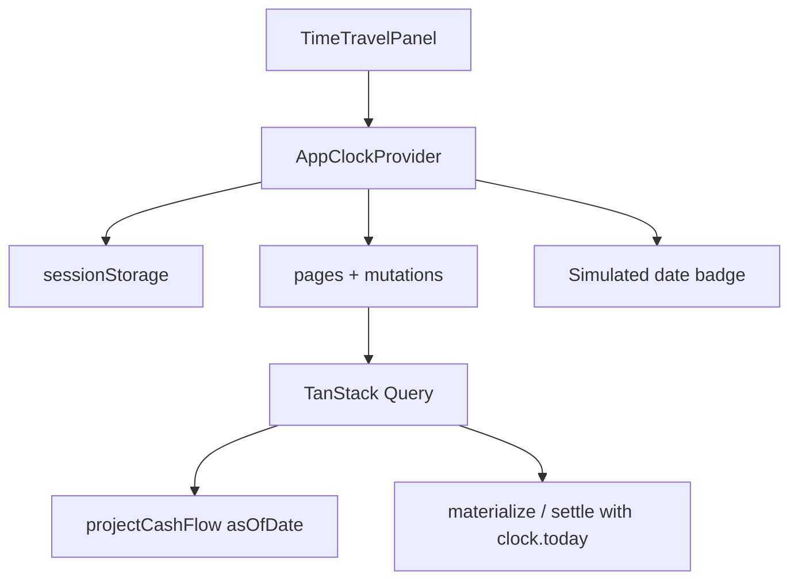

# Epic 12 — Developer tools (time travel)

Dev-only utilities for manual QA and flow testing without waiting for real calendar dates.

**Status (2026-07-05):** Not implemented. The app uses `todayIso()` from `@cashflow/core` (wraps `new Date()`) in dozens of call sites — queries, mutations, statement materialization, and settlement defaults. Some hooks already accept `asOfDate` (`useCalendarScreen`, `useProjection`) but nothing in the UI exposes it. Seed data is pinned to June 2026 (`main.tsx` uses `materializeAllCreditCardStatements("2026-06-28")`), so testing statement due dates, carryover, and mark-paid flows requires either fixture tests or manually editing data.

**Motivation:** Credit card flows (US-6.6), calendar projection, installment payoffs, and category budgets all depend on “today”. A **time travel** panel lets developers jump to any date and walk through end-to-end behavior in the running app.

---

## US-12.1 — Injectable application clock

**Persona:** Developer

**Story:** As a developer, I want a **single source of truth for “today”** so every layer uses the same simulated date when time travel is active.

**Priority:** P1  
**Depends on:** US-0.2

### Problem

`todayIso()` is called directly from:

- **App queries:** `useAccounts`, `useProjection`, `useCalendarScreen`, `useForecastScreen`, `useStatementDetail`
- **Mutations:** mark paid / settle flows (`usePlannedItemMutations`, `useInstallmentMutations`, `useStatementMutations`, `useCalendarQuickAdd`)
- **DB layer:** `materializeStatementsForCard`, `recomputeStatementTotalsForCard`, `creditCardStatementsRepo.markUnpaid`, `listStatementCharges`

When the simulated date changes, all of these must agree.

### Design

Introduce a **clock provider** in `packages/app` (not persisted user Settings):

```ts
type AppClock = {
  /** Effective today for the whole app. Real calendar date when not overridden. */
  today: string; // ISO YYYY-MM-DD
  isOverridden: boolean;
  setToday: (iso: string) => void;
  resetToday: () => void;
};
```

- `today` defaults to real `todayIso()` from `@cashflow/core`.
- Override stored in **sessionStorage** (survives reload during a QA session; cleared when tab closes).
- `@cashflow/core` keeps `todayIso()` as the real-clock helper for tests and server-less engine runs; the app reads `useAppClock().today` instead of calling `todayIso()` at runtime.

### Acceptance criteria

- [ ] `AppClockProvider` wraps the app in `main.tsx` (inside `QueryClientProvider`)
- [ ] `useAppClock()` hook returns `today`, `isOverridden`, `setToday`, `resetToday`
- [ ] Override persisted in `sessionStorage` under a dev-only key (e.g. `cashflow:devClock`)
- [ ] Invalid JSON / missing key falls back to real today
- [ ] Unit test: provider returns override when sessionStorage is set

---

## US-12.2 — Time travel panel UI

**Persona:** Developer

**Story:** As a developer, I want an **overlapping panel** where I can choose the system’s current date so I can test dated flows without changing my OS clock.

**Priority:** P1  
**Depends on:** US-12.1, US-11.1

### UI spec

Floating **dev tools** affordance — not part of the user-facing Settings screen.

| Element | Behavior |
|---|---|
| **Trigger** | Fixed pill or icon button (e.g. bottom-right), visible only in dev builds |
| **Panel** | Overlapping slide-over or popover (`role="dialog"`), same pattern as `StatementListPanel` / `EditorPanel` |
| **Date picker** | ISO date input; default = current effective today |
| **Apply** | Sets simulated today via `setToday` |
| **Reset** | `resetToday()` → real calendar date |
| **Badge** | When overridden, persistent banner or pill: “Simulated: 2026-08-01” so it is never confused with production |
| **Keyboard** | `Esc` closes panel; focus trap while open |

Optional shortcuts (P2, can defer):

- **−1 day / +1 day** step buttons
- **Presets:** “Seed anchor date”, “Next statement due”, “Next negative date” (derived from current projection)

### Acceptance criteria

- [ ] Panel opens from dev trigger; does not appear in production builds (`import.meta.env.PROD` guard)
- [ ] Date picker sets simulated today on Apply
- [ ] Reset restores real today and clears sessionStorage
- [ ] Simulated-date badge visible app-wide while override is active
- [ ] Storybook story for panel in isolated state (mock clock provider)
- [ ] Panel z-index above main content but below modal editors if both open (document stacking rule)

---

## US-12.3 — Wire app-wide refresh to simulated date

**Persona:** Developer

**Story:** As a developer, I want **every screen and mutation to respect the simulated date** so time travel actually changes what I see and what I settle.

**Priority:** P1  
**Depends on:** US-12.1, US-12.2

### Scope — reads (must use `useAppClock().today`)

| Area | Current | Expected after |
|---|---|---|
| Calendar / year / month | `useCalendarScreen(todayIso())` | `useCalendarScreen(clock.today)` |
| Projection header metrics | `useProjection()` | `useProjection(clock.today)` |
| Working balance today | `useAccounts` → `todayIso()` | `clock.today` |
| Forecast “next due” / active rows | `useForecastScreen` | filter and previews relative to `clock.today` |
| Statement charges (projected badge) | `listStatementCharges(..., todayIso())` | `clock.today` |
| Statement status (`open` / `closed`) | `creditCardStatementsRepo` uses `todayIso()` | recompute or resolve status against `clock.today` |

### Scope — writes (default effective date)

| Action | Expected default |
|---|---|
| Mark planned item paid | `effectiveDate = clock.today` |
| Mark installment paid | `effectiveDate = clock.today` |
| Mark / record statement payment | `effectiveDate = clock.today` |
| Calendar quick-add transaction | `effectiveDate = selectedDay ?? clock.today` |
| New transaction / planned item | date fields default to `clock.today` |

### Query invalidation

When `today` changes, invalidate all date-sensitive queries:

- `queryKeys.projection(asOfDate)` for **both** old and new date (or prefix `["projection"]`)
- `accounts`, `forecast`, `creditCardStatements`, `statementDetail`, `categories`, `transactions`

Consider including `clock.today` in TanStack Query keys where projection depends on it.

### Acceptance criteria

- [ ] Changing simulated date refreshes calendar red dots, working balance header, and forecast “next” rows without manual reload
- [ ] Mark-paid on a future simulated date creates settlement with that date
- [ ] Statement list shows `closed` vs `open` correctly when simulated date passes `closingDate`
- [ ] No remaining direct `todayIso()` calls in `packages/app` except inside `AppClockProvider` bootstrap
- [ ] Documented list of wired call sites in epic status or code comment at provider

---

## US-12.4 — Dev-only safety and discoverability

**Persona:** Developer

**Story:** As a developer, I want time travel **impossible to enable in production** and easy to discover locally so it never affects real users.

**Priority:** P1  
**Depends on:** US-12.2

### Acceptance criteria

- [ ] Trigger, panel, and badge compiled out or hidden when `import.meta.env.PROD === true`
- [ ] Optional env flag `VITE_ENABLE_TIME_TRAVEL=true` for staging builds; default off
- [ ] Simulated date never written to `Settings` entity or export JSON
- [ ] README / dev docs section: how to open panel, reset, and test credit-card checklist (link to US-6.6)
- [ ] E2E tests continue using real dates or inject clock via test helper — panel not required in CI

---

## US-12.5 — Time-travel flow test scenarios

**Persona:** Developer / QA

**Story:** As a developer, I want **documented walkthroughs** that use time travel so we can verify cross-epic flows manually before release.

**Priority:** P2  
**Depends on:** US-12.3, US-6.6

### Scenario scripts (minimum)

| # | Start date | Action | Expected |
|---|---|---|---|
| 1 | `2026-06-28` (seed) | Open Cora statements | Jul 3 due shows opening debt R$ 1.850 |
| 2 | `2026-07-01` | Calendar month view | Statement due outflow on working account |
| 3 | `2026-07-03` | Mark statement paid | Transfer created; projection suppresses duplicate |
| 4 | `2026-06-27` | Add card purchase | Accrues to Jul 26 statement; working hit Aug 1 |
| 5 | `2026-08-01` | After US-6.5 lands | Partial pay → carryover visible on next fatura |
| 6 | Any | Step +7 days | Recurring planned items fire on correct `dayOfMonth` |

### Acceptance criteria

- [ ] Scenarios listed in this epic or linked from US-6.6 checklist
- [ ] Each scenario pass/fail can be recorded manually during QA
- [ ] Optional: panel preset buttons jump to dates from table above

---

## Architecture sketch



## Out of scope (Phase 1)

- Time travel in Storybook global decorator (use fixture `asOfDate` per story instead)
- Simulating time **speed** (auto-advance days) — manual date pick only
- Multi-user or persisted “scenario saves” beyond sessionStorage
- Changing timezone; all dates remain local ISO calendar dates

## Related stories

- [US-6.6](./06-credit-cards.md#us-66--review-credit-card-flows-end-to-end) — primary consumer of time travel for card QA
- [US-3.1](./03-calendar.md) — calendar views driven by `asOfDate`
- [US-10.1](./10-settings-data.md) — user Settings (buffer, horizon); distinct from dev clock
