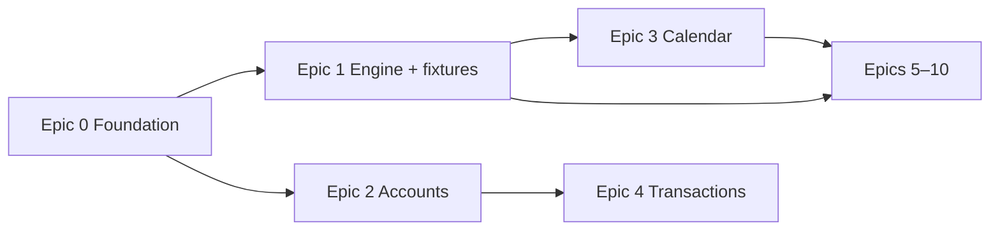

# User Stories — Phase 1

User stories and acceptance criteria for the Cashflow app. The [PRD](../specs/005-prd.md) summarizes goals and phasing; this folder is the **detailed backlog**.

---

## Read order

| Epic | File | Stories | Build order |
|---|---|---|---|
| 0 — Foundation | [00-foundation.md](./00-foundation.md) | US-0.1 – US-0.4 | **First** |
| 1 — Projection engine | [01-projection-engine.md](./01-projection-engine.md) | US-1.1 – US-1.9 | **Second** (parallel with 0.3+) |
| 2 — Accounts | [02-accounts.md](./02-accounts.md) | US-2.1 – US-2.5 | After engine + storage |
| 3 — Calendar | [03-calendar.md](./03-calendar.md) | US-3.1 – US-3.11 | After engine |
| 4 — Transactions | [04-transactions.md](./04-transactions.md) | US-4.1 – US-4.5 | After accounts |
| 5 — Forecast | [05-forecast.md](./05-forecast.md) | US-5.1 – US-5.5 | After engine |
| 6 — Credit cards | [06-credit-cards.md](./06-credit-cards.md) | US-6.1 – US-6.6 | Engine + accounts |
| 7 — Installments | [07-installments.md](./07-installments.md) | US-7.1 – US-7.3 | Engine + forecast |
| 8 — Categories & budgets | [08-categories-budgets.md](./08-categories-budgets.md) | US-8.1 – US-8.3 | After transactions |
| 9 — Snapshots | [09-snapshots.md](./09-snapshots.md) | US-9.1 – US-9.2 | **Phase 2** (deferred from v1) |
| 10 — Settings & data | [10-settings-data.md](./10-settings-data.md) | US-10.1 – US-10.3 | Throughout |
| 11 — Design system | [11-design-system.md](./11-design-system.md) | US-11.1 – US-11.5 | Parallel with UI epics |
| 12 — Developer tools | [12-developer-tools.md](./12-developer-tools.md) | US-12.1 – US-12.5 | Parallel with app epics |

---

## Story ID convention

`US-{epic}.{story}` — e.g. `US-1.3` = Projection engine epic, story 3.

Each story includes:

- **Persona** — who benefits
- **Story** — As a / I want / So that
- **Acceptance criteria** — testable Given/When/Then bullets
- **Priority** — P0 (must ship Phase 1) / P1 (should) / P2 (nice)
- **Depends on** — upstream story IDs

---

## Recommended implementation sequence

1. **Foundation** — repo, tech stack decision, Storybook shell  
2. **Engine + fixtures** — pure JS projection with tests (no UI persistence yet)  
3. **Calendar** — wire Year/Month views to real `ProjectionResult`  
4. **Accounts + Transactions + Forecast** — CRUD + storage  
5. **Remaining epics** — credit cards UI, installments, budgets, settings

---

## Traceability

| Document | Role |
|---|---|
| [005-prd.md](../specs/005-prd.md) | Goals, personas, release definition |
| [002-phase-1-scope.md](../specs/002-phase-1-scope.md) | Locked in/out of scope |
| [001-data-model.md](../specs/001-data-model.md) | Entity fields engine and CRUD must honor |
| [003-screen-specs.md](../specs/003-screen-specs.md) | UI behavior per screen |
| [006-project-structure.md](../specs/006-project-structure.md) | Monorepo layout, runtime layers, typical user flows |

# Current priority list:

- Persistent storage (data survives reload)
- Credit card partial payments + carryover (US-6.5)
- Accounts polish (validation, re-anchor, archived list)
- Skip single forecast occurrence
- Design system cards + mobile calendar polish
- App design improvement
- Multi-day selection on year calendar (US-3.11)